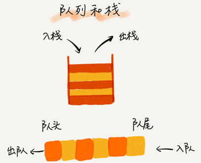

# 数据结构与算法之第四篇.栈和队列

## 1、 概述

栈和队列主要用于在计算过程中**保存临时数据的容器**。

### 1.1 栈、队列和数据使用顺序

栈和队列也是最简单的缓存结构，它们**只支持**数据项的**存储**和**访问**，不支持数据项之间任何关系。
\- 栈：后进先出（Last In First Out，LIFO）
\- 队列：先进先出（First In First Out，FIFO）
应该用**线性表**作为**栈**和**队列**的实现结构。


### 1.2 应用环境


## 2、 栈：概念和实现

栈（stack，也称堆栈）是一种容器，可存入数据元素、访问元素、删除元素等。存入栈中的元素之间相互没有任何具体关系，**只有到来的时间的先后顺序**。在这里没有元素的位置、元素的前后顺序等概念。


**栈**的**基本性质保证**，在**任何时刻**可以**访问、删除**的**元素**都是**在此之前最后存入**的那个**元素**。因此，**栈确定了**一种**默认元素访问顺序** ，访问时**无需其他信息**。

### 2.1 栈抽象数据类型

栈的抽象数据类型描述：


### 2.2 **栈的线性表实现**

用**线性表**的技术**实现栈**时，操作**只**在**表的一端**进行，**不涉及另一端**，更**不涉及**表的**中间**部分。栈既可以用数组来实现，也可以用链表来实现。用数组实现的栈，我们叫作**顺序栈**，用链表实现的栈，我们叫作**链式栈**。

对于顺序表，后端插入和删除是O(1)的操作，应该用这一端作为栈顶。
对于连接表，前端插入和删除都是O(1)的操作，应该使用这一端作为栈顶。

顺序表扩大存储需要做一次高代价操作；另外顺序表需要完整的的大块存储区。采用连接技术，在这两个问题上都有优势。链接实现的缺点是更多依赖于解释器的存储管理，每个节点的链接开销，以及链接节点在实际计算机内存中任意散布肯能带来的开销。
### 2.3 栈的顺序表（数组）实现

```python
class ArrayStack():
    """基于数组实现的顺序栈"""
def __init__(self, n: int):
    self.items = [None] * n  # 数组
    self.count = 0  # 栈中元素的个数
    self.n = n  # 栈的大小

def push(self, item) -> bool:
    # 数组空间不够了，直接返回 false，入栈失败。
    if self.count == self.n:
        return False
    # 将item放到下标为count的位置，并且count加1
    self.items[self.count] = item
    self.count += 1
    return True

def pop(self):
    # 栈为空，则直接返回 None
    if self.count == 0:
        return None
    # 返回下标为count-1的数组元素，并且栈中元素个数count减1
    tmp = self.items[self.count - 1]
    self.count -= 1
    return tmp

def __str__(self):
    return str(self.items[:self.count])
```
### 2.4 栈的链表实现

python的栈实现：

```python
class ListNode:
    def __init__(self, data: int, next=None):
        self._data = data
        self._next = next


class LinkedStack:
    """基于单链表实现的栈
    """

    def __init__(self):
        self._top: ListNode = None

    def push(self, value):
        # 添加元素
        new_top = ListNode(value)
        new_top._next = self._top
        self._top = new_top
        return True

    def pop(self):
        # 删除并返回栈顶元素
        value = self._top._data
        self._top = self._top._next
        return value

    def __str__(self) -> str:
        vals = []
        p: ListNode = self._top
        while p:
            vals.append(str(p._data))
            p = p._next
        return '->'.join(vals)
```

不管是顺序栈还是链式栈，存储数据只需要一个大小为 n 的存储空间。

在入栈和出栈过程中，只需要一两个临时变量存储空间，所以**空间复杂度是 O(1)**。

**空间复杂度是指除了原本的数据存储空间外，算法运行还需要额外的存储空间。**

不管是顺序栈还是链式栈，入栈、出栈只涉及栈顶个别数据的操作，所以**时间复杂度都是 O(1)**。

### 2.5 支持扩容的栈

上面基于数组实现的栈，当栈满之后，就无法再往栈里添加数据了。尽管链式栈的大小不受限，但要存储 next 指针，内存消耗相对较多。

**注意：python的列表本身支持动态扩容，不需要自己实现细节。**

要实现一个支持动态扩容的栈，我们只需要底层依赖一个支持动态扩容的数组就可以了。当栈满了之后，我们就申请一个更大的数组，将原来的数据搬移到新数组中：


出栈的时间复杂度是 O(1)，因为出栈操作不会涉及内存的重新申请和数据的搬移。

对于入栈操作来说，最好情况时间复杂度是 O(1)，最坏情况时间复杂度是 O(n)。当栈中有空闲空间时，入栈操作的仅1次赋值操作。但当空间不够时，就需要重新申请内存和数据搬移。

对于平均情况下的时间复杂度，可以采用摊还分析法。

假设：

- 栈空间不够时，重新申请一个是原来大小两倍的数组；
- 只有入栈操作没有出栈操作；
- 入栈操作均为 simple-push 操作，时间复杂度为 O(1)。

如果当前栈大小为 K已满，入栈时就要重新申请 2 倍大小的内存，并且做 K 个数据的搬移操作，然后再入栈。但接下来的 K-1 次入栈操作都只需要一个 simple-push 操作就可以完成：


这 K 次入栈操作，总共涉及了 K 个数据的搬移，以及 K 次 simple-push 操作。将 K 个数据搬移均摊到 K 次入栈操作，那每个入栈操作只需要一个数据搬移和一个 simple-push 操作。以此类推，入栈操作的均摊时间复杂度就为 O(1)。

**均摊时间复杂度一般都等于最好情况时间复杂度。**因为在大部分情况下，入栈操作的时间复杂度 O 都是 O(1)，只有在个别时刻才会退化为 O(n)，所以把耗时多的入栈操作的时间均摊到其他入栈操作上，平均情况下的耗时就接近 O(1)。


### 2.6 栈与递归

如果在一个定义了中（如python的函数）引用了被定义的对象（被定义的函数）本身，这种定义被称为递归。在递归定义或结构中，递归的部分必须比原来的整体简单，这样才有可能到达某种终节点（即递归的出口）。显然，这种终节点不能是递归的。在递归结构中，必须存在非递归的基本结构构成的成分。如果不是这样就会出现无限递归。例如，节点链的空连接就是递归的终点。

**栈与递归/函数调用**
在程序执行中，函数的嵌套调用是按“后调用先返回的”规则进行，这种规则符合栈的使用模式，因此可以用栈来实现。
函数调用的前序动作按顺序包括：
- 被调用函数的局部变量和形式参数分配存储区（称为函数帧/活动记录/数据区）
- 将所有实参和函数的返回地址存入函数帧（实参形参的结合/传值）
- 将控制转到被调用函数的入口。
函数调用的后序动作（函数返回时完成）是：
- 被调用函数的计算结果存入指定位置。
- 释放被调用函数的存储区（帧）
- 按以前保存的返回地址将控制转回调用函数。

##### **递归与非递归**
对于递归定义的函数，每个实际调用时执行的都是该函数体的代码，只是需要在一个内部运行栈里保存各次调用的局部信息。这种情况说明，完全有可能修改函数定义，把一个递归定义的函数改造为一个非递归函数
递归定义的阶乘函数，与之对应的非递归形式，用自己定义的栈模拟系统的运行栈。

##### **递归函数与非递归函数**
目前来说，函数调用损失的效率多半都可以接受，通常直接采用递归定义的函数就可以满足要求，不一定需要考虑非递归函数的定义。只有一些极为特殊的情况，由于效率要求特别高等原因，可能需要做这种工作。

### 2.6 栈在软件工程中的实际应用

#### 函数调用栈

操作系统给每个线程分配了一块独立的内存空间，这块内存被组织成“栈”这种结构, 用来存储函数调用时的临时变量。每进入一个函数，就会将临时变量作为一个栈帧入栈，当被调用函数执行完成，返回之后，将这个函数对应的栈帧出栈：

```c
int main() {
   int a = 1; 
   int ret = 0;
   int res = 0;
   ret = add(3, 5);
   res = a + ret;
   printf("%d", res);
   reuturn 0;
}
 
int add(int x, int y) {
   int sum = 0;
   sum = x + y;
   return sum;
}
```

main() 函数调用了 add() 函数，获取计算结果，并且与临时变量 a 相加，最后打印 res 的值。

下图表示在执行到 add() 函数时，函数调用栈出栈、入栈的的情况。


#### 栈实现表达式求值

编译器如何利用栈来实现**表达式求值**？比如：34+13*9+44-12/3。

需要两个栈来实现：一个栈保存操作数，另一个栈保存运算符。

从左向右遍历表达式，遇到数字就压入操作数栈；

遇到运算符，就与运算符栈的栈顶元素进行比较。如果比运算符栈顶元素的优先级高，就将当前运算符压入栈；如果比运算符栈顶元素的优先级低或者相同，从运算符栈中取栈顶运算符，从操作数栈的栈顶取 2 个操作数，然后进行计算，再把计算完的结果压入操作数栈，继续比较。

下图是 3+5*8-6 这个表达式的计算过程：


#### 实现浏览器的前进和后退功能

依次访问完一串页面 a-b-c 之后，点击浏览器的后退按钮，就可以查看之前浏览过的页面 b 和 a。后退到页面 a，点击前进按钮，就可以重新查看页面 b 和 c。但是，如果后退到页面 b 后，点击了新的页面 d，那就无法再通过前进、后退功能查看页面 c 了。如何实现这个功能呢？

使用两个栈X 和 Y即可实现：

**栈 X中的栈顶数据表示当前访问的页面**

打开页面时将数据压入栈 X，并清空栈Y。

当点击后退按钮时，取出栈 X数据 并放入栈 Y中。

当点击前进按钮时，取出栈 Y 数据放入栈 X 中。

当栈 X 中仅剩1个数据时，那就说明没有页面可以继续后退浏览了。

当栈 Y 中没有数据，那就说明没有页面可以点击前进按钮浏览了。


流程示例：顺序查看了 a，b，c 三个页面，就依次把 a，b，c 压入栈X：


点击后退按钮，从页面 c 后退到页面 a 之后，就依次把 c 和 b 从栈 X 中弹出，并且依次放入到栈 Y：


又点击前进按钮回到 b 页面，就把 b 再从栈 Y 中出栈，放入栈 X 中：


通过页面 b 访问新页面 d，则将d放入X中，同时清空栈 Y ：


总之，后退时将页面从X移动到Y；前进则将页面从Y移动到X；访问新页面时，则将新页面压入X，并清空Y。

三种操作都是取X的栈顶元素显示。

python代码实现：

```python
from collections import deque


class Browser():

    def __init__(self):
        self.x_stack = deque()
        self.y_stack = deque()

    def can_back(self):
        return len(self.x_stack) > 1

    def can_forward(self):
        return len(self.y_stack) > 0

    def open(self, url):
        print("Open new url %s" % url, end="\n")
        self.x_stack.appendleft(url)
        self.y_stack.clear()

    def back(self):
        if self.can_back():
            self.y_stack.appendleft(self.x_stack.popleft())
            print("back to %s" % self.x_stack[0], end="\n")

    def forward(self):
        if self.can_forward():
            self.x_stack.appendleft(self.y_stack.popleft())
            print("forward to %s" % self.x_stack[0], end="\n")

    def __str__(self):
        return "X:HEAD=>%s,Y:HEAD=>%s" % ("->".join(self.x_stack) or "None", "->".join(self.y_stack) or "None")
```


## 3、 队列

队列（queue），也是一种容器，可存入、访问、删除元素。队列最大的特点就是先进先出，主要的两个操作是入队和出队。跟栈一样，它既可以用数组来实现，也可以用链表来实现。用数组实现的叫**顺序队列**，用链表实现的叫**链式队列**。特别是长得像一个环的循环队列。在数组实现队列的时候，会有数据搬移操作，要想解决数据搬移的问题，就需要循环数组实现的循环队列。



### 3.1 队列抽象数据类型

**加图！！！！！**

### 3.2 队列的顺序表实现

```python
from typing import Optional


class ArrayQueue:
    """用数组实现的队列"""

    def __init__(self, capacity: int):
        self.items: list = [None] * capacity
        self._capacity = capacity
        self.head = 0  # 队头下标
        self.tail = 0  # 队尾下标

    def enqueue(self, item: str) -> bool:
        """入队"""
        if self.tail == self._capacity:
            return False
        self.items[self.tail] = item
        self.tail += 1
        return True

    def dequeue(self) -> Optional[str]:
        """出队"""
        if self.head == self.tail:
            return None
        item = self.items[self.head]
        self.head += 1
        return item

    def __str__(self) -> str:
        return str(self.items[self.head:self.tail])
```

队列需要两个指针：一个是 head 指针，指向队头；一个是 tail 指针，指向队尾。

当 a、b、c、d 依次入队之后，队列中的 head 指针指向下标为 0 的位置，tail 指针指向下标为 4 的位置。


调用两次出队操作之后，队列中 head 指针指向下标为 2 的位置，tail 指针仍然指向下标为 4 的位置。


随着不停地进行入队、出队操作，head 和 tail 都会持续往后移动。

当 tail 移动到最右边，即使数组中还有空闲空间，也无法继续往队列中添加数据了。这时只需要触发一次数据的搬移操作即可：

```python
def enqueue(self, item: str) -> bool:
    """入队"""
    # 表示队列末尾没有空间了
    if self.tail == self.capacity:
        if self.head == 0: return False
        # 数据搬移
        for i in range(self.head, self.tail):
            self.items[i - self.head] = self.items[i]
        # 搬移完之后重新更新 head 和 tail
        self.tail -= self.head
        self.head = 0
    self.items[self.tail] = item
    self.tail += 1
    return True
```

上面的代码中，当队列的 tail 指针移动到数组的最右边后，如果有新的数据入队，就将 head 到 tail 之间的数据，整体搬移到数组中 0 到 tail-head 的位置。


这种实现思路中，出队入队操作的时间复杂度是 **O(1)**


### 3.3 队列的链表实现

基于链表的实现，需要head 和 tail 两个指针。分别指向链表的第一个和最后一个结点。

入队时，tail->next= new_node, tail = tail->next；出队时，head = head->next。


```python
from typing import Optional


class ListNode:

    def __init__(self, data: str, next=None):
        self.data = data
        self._next = next


class LinkedQueue:

    def __init__(self):
        self._head: Optional[ListNode] = None
        self._tail: Optional[ListNode] = None

    def enqueue(self, value: str):
        # 入队
        new_node = ListNode(value)
        if self._tail:
            self._tail._next = new_node
        else:
            self._head = new_node
        self._tail = new_node

    def dequeue(self) -> Optional[str]:
        """出队"""
        if self._head:
            value = self._head.data
            self._head = self._head._next
            if not self._head:
                self._tail = None
            return value

    def __str__(self) -> str:
        values = []
        p: ListNode = self._head
        while p:
            values.append(p.data)
            p = p._next
        return "->".join(values)
```


### 3.4 循环数组实现的队列

上面用数组来实现队列的时候，在 tail==n 时，会有数据搬移操作，采用循环数组则不需要数据搬移操作。

原本数组是有头有尾的是一条直线，把它首尾相连扳成一个环：


图中这个队列的大小为 8，当前 head=4，tail=7。

当有一个新的元素 a 入队时，放入下标为 7 的位置， tail 并不更新为 8，而是到下标为 0 的位置。

当再有一个元素 b 入队时，将 b 放入下标为 0 的位置，然后 tail 加 1 更新为 1。

在 a，b 依次入队之后，循环队列中的元素就变成了下面的样子：


**确定队空和队满的判定条件**。

队列为空的判断条件是 head == tail。


如上图，显然队列满的判断条件是**(tail+1)%n=head**，

为了避免和队空的判断条件混淆，则必须牺牲一个数组的存储空间。

python实现代码：

```python
from typing import Optional


class CircularQueue:
    def __init__(self, capacity):
        self.capacity = capacity + 1
        self.items = [None] * self.capacity
        self.head = 0  # head表示队头下标
        self.tail = 0  # tail表示队尾下标

    def enqueue(self, item: str) -> bool:
        """入队"""
        if (self.tail + 1) % self.capacity == self.head:
            return False
        self.items[self.tail] = item
        self.tail = (self.tail + 1) % self.capacity
        return True

    def dequeue(self) -> Optional[str]:
        # 如果head == tail 表示队列为空
        if self.head == self.tail: return None
        item = self.items[self.head]
        self.head = (self.head + 1) % self.capacity
        return item

    def __str__(self) -> str:
        if self.tail >= self.head:
            return str(self.items[self.head: self.tail])
        else:
            return str(self.items[self.head:] + self.items[:self.tail])
```

### 3.5 队列类的实现


```
class SQueue():
    def __init__(self, init_len=8):
        self._len = init_len          # 存储区长度
        self._elems = [0]*init_len    # 元素存储
        self._head = 0                # 表头元素下标
        self._num = 0                 # 元素个数

    def is_empty(self):
        return self._num == 0

    def peek(self):
        if self._num == 0:
            raise QueueUnderflow
        return self._elems[self._head]

    def dequeue():
        if self._num == 0:
            raise QueueUnderflow
        e = self._elems[self._head]
        self._head = (self._head+1) % self.len
        self._num -= 1
        return e

    def enqueue(self, e):
        if self._num == self._len:
            self.__extend()
        self._elems[(self._head+self._num) % self._len] = e
        self._num += 1

    def __extend(self):
        old_len = self._len
        self._len *= 2
        new_elems = [0]*self._len
        for i in range(old_len):
            new_elems[i] = self._elems[(self._head+i)%old_len]
        self._elems, self._head = new_elems, 0  
```

### 3.6 队列在实际开发中的应用

#### 阻塞队列

**阻塞队列**其实就是在队列基础上增加了阻塞操作。简单来说，就是在队列为空的时候，从队头取数据会被阻塞。因为此时还没有数据可取，直到队列中有了数据才能返回；如果队列已经满了，那么插入数据的操作就会被阻塞，直到队列中有空闲位置后再插入数据，然后再返回。


使用阻塞队列，就可以轻松实现一个“生产者 - 消费者模型”！

这种基于阻塞队列实现的“生产者 - 消费者模型”，可以有效地协调生产和消费的速度。当“生产者”生产数据的速度过快，“消费者”来不及消费时，存储数据的队列很快就会满了。这个时候，生产者就阻塞等待，直到“消费者”消费了数据，“生产者”才会被唤醒继续“生产”。

还可以通过协调“生产者”和“消费者”的个数，来提高数据的处理效率。

可以多配置几个“消费者”，来应对一个“生产者”：


python基于阻塞队列实现的**生产者 - 消费者模型**：

```python
import queue
import random
import threading
import time


class Producer(threading.Thread):
    nameList = ["apple", "peach", "pineapple", "orange", "banana", "blueberry"]
    flag = 1

    def __init__(self, q, name):
        threading.Thread.__init__(self)
        self.name = name
        self.q = q

    def run(self):
        name_list = Producer.nameList
        while Producer.flag:
            queueLock.acquire()
            if not self.q.full():
                data = name_list[random.randrange(0, len(name_list))]
                self.q.put(data)
                print("%s 生产数据: %s" % (threading.currentThread().name, data))
                queueLock.release()
            else:
                queueLock.release()
            time.sleep(random.random() * 3)


class Consumer(threading.Thread):
    flag = 1

    def __init__(self, q, name):
        threading.Thread.__init__(self)
        self.name = name
        self.q = q

    def run(self):
        while Consumer.flag:
            queueLock.acquire()
            if not self.q.is_empty():
                data = self.q.get()
                print("%s 消费数据: %s" % (threading.currentThread().name, data))
                queueLock.release()
            else:
                queueLock.release()
            time.sleep(random.random() * 4)


workQueue = queue.Queue(5)
queueLock = threading.Lock()
# 创建新线程
Producer(workQueue, "Producer1").start()
Producer(workQueue, "Producer2").start()
Consumer(workQueue, "Consumer1").start()
Consumer(workQueue, "Consumer2").start()
Consumer(workQueue, "Consumer3").start()

while 1:
    time.sleep(1)
    print(workQueue.queue)
```

#### 并发队列

在多线程情况下，会有多个线程同时操作队列，这个时候就会存在线程安全问题。

线程安全的队列叫作**并发队列**。最简单直接的实现方式是直接在 enqueue()、dequeue() 方法上加锁，但是锁粒度大并发度会比较低，同一时刻仅允许一个存或者取操作。实际上，基于数组的循环队列，利用 CAS 原子操作，可以实现非常高效的并发队列。这也是循环队列比链式队列应用更加广泛的原因。

#### 有限资源池

常见的有限资源池有线程池和数据库连接池。

CPU 资源是有限的，任务的处理速度与线程个数并不是线性正相关。相反，过多的线程反而会导致 CPU 频繁切换，处理性能下降。所以，线程池的大小一般都是综合考虑要处理任务的特点和硬件环境，来事先设置的。

**当我们向固定大小的线程池中请求一个线程时，如果线程池中没有空闲资源了，这个时候线程池如何处理这个请求？是拒绝请求还是排队请求？各种处理策略又是怎么实现的呢？**

线程池一般有两种处理策略：

- 非阻塞的处理方式，直接拒绝任务请求；
- 阻塞的处理方式，将请求排队，等到有空闲线程时，取出排队的请求继续处理。


我们希望公平地处理每个排队的请求，先进者先服务，队列这种数据结构很适合来存储排队请求。

基于链表实现的队列，可以实现一个支持无限排队的无界队列（unbounded queue），但是可能会导致过多的请求排队等待，请求处理的响应时间过长。所以，针对响应时间比较敏感的系统，基于链表实现的无限排队的线程池是不合适的。

基于数组实现的有界队列（bounded queue），队列的大小有限，所以线程池中排队的请求超过队列大小时，接下来的请求就会被拒绝，这种方式对响应时间敏感的系统来说，就相对更加合理。

队列设置太大会导致等待的请求太多，设置太小会导致无法充分利用系统资源、发挥最大性能。


**对于大部分资源有限的场景，当没有空闲资源时，基本上都可以通过“队列”这种数据结构来实现请求排队。**


