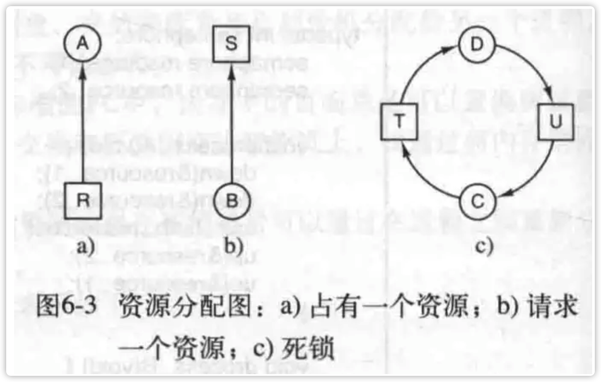
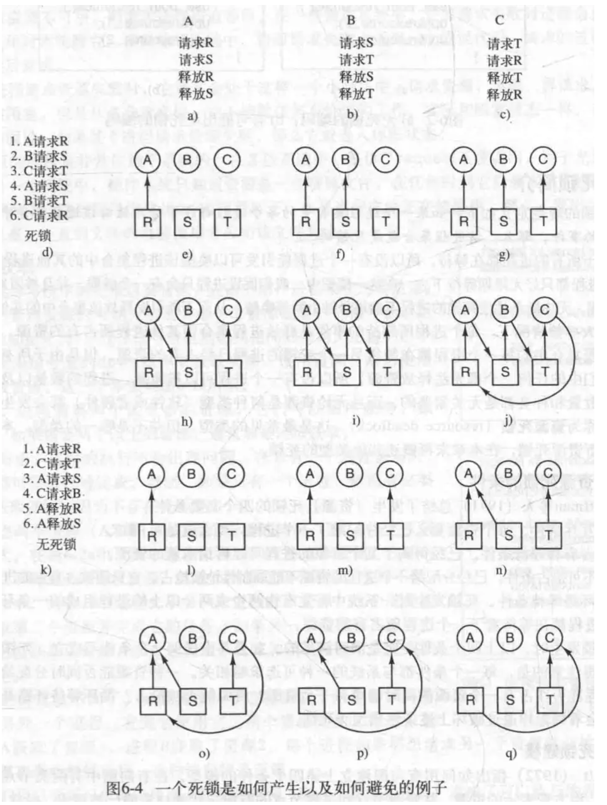
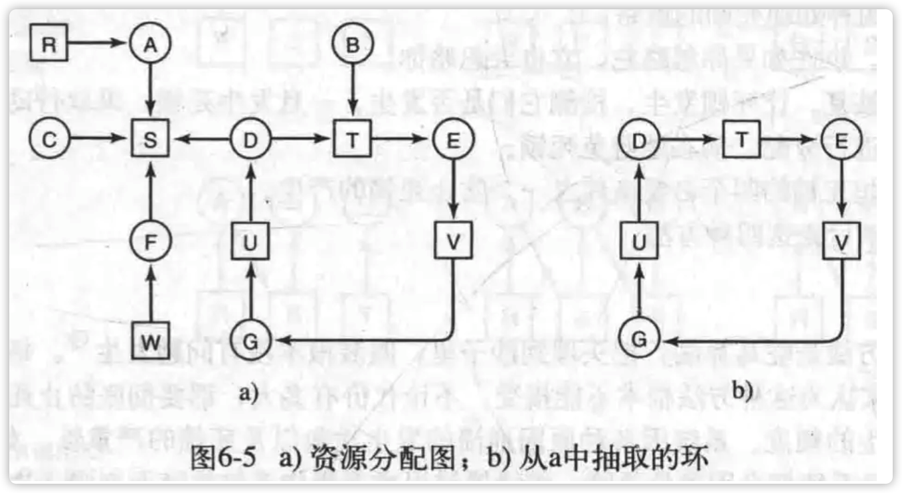
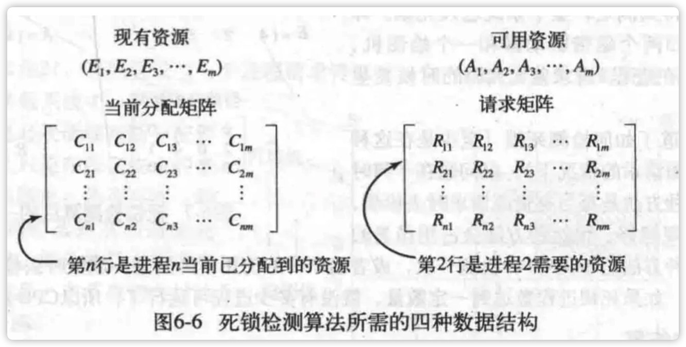
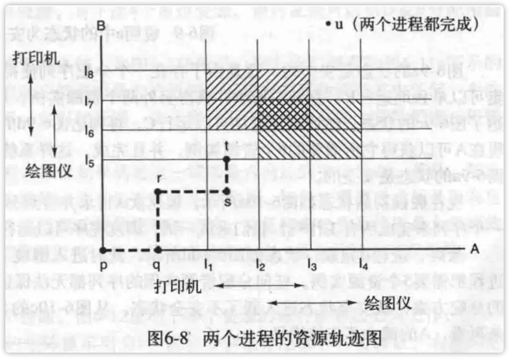
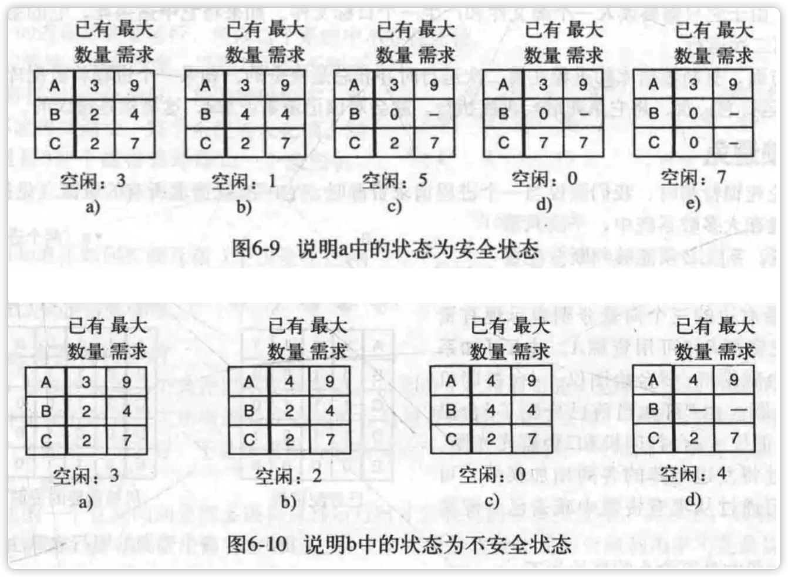
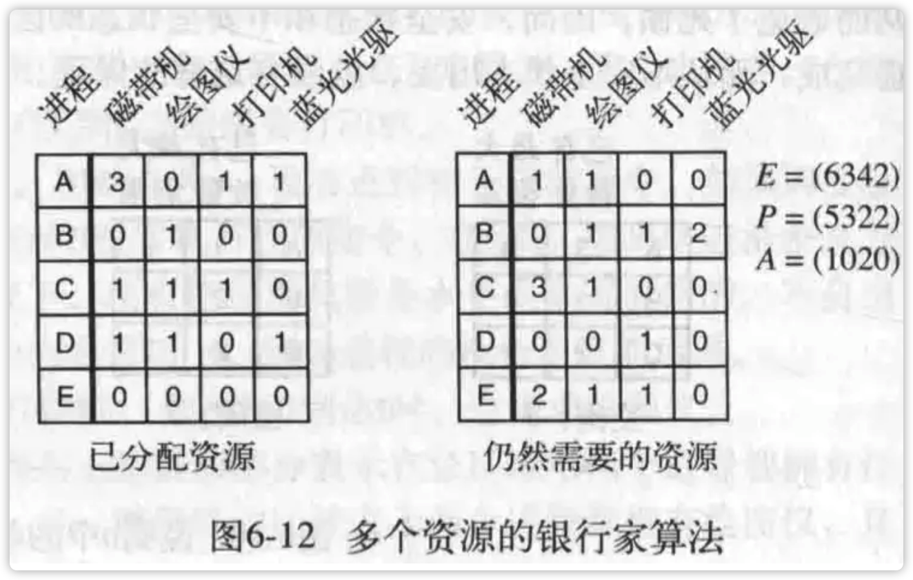

## 第六篇.操作系统之死锁

## 一、资源

需要排他性地使用的对象称为资源。资源可以是硬件设备(打印机，扫描仪)，也可以是数据库里地一条加锁记录。在一台计算机里，可能有多种资源，每种资源的实例可能不止一种。

### 1.资源种类

资源分为两类，可抢占资源和不可抢占资源。

**可抢占资源**指的是，可以从拥有它的进程中抢占而不会产生任何副作用，存储器（因为可以被换出）就是典型的例子。

**不可抢占资源**指的是，在不引起相关计算失败的情况下，无法把它从正在使用它地进程里抢占过来。

总的来说，死锁和不可抢占资源有关。抢占资源地潜在死锁可以通过资源的再分配化解。

使用一个资源所需要的事件顺序可以抽象如下：

```
1. 请求资源
2. 使用资源
3. 释放资源
```

一般来说，进程请求失败后，会被阻塞，在资源可用时会再次唤醒它。进程如果请求失败了，可能会过会再试。我们假设，如果进程请求失败，它会进入休眠状态，这和被阻塞类似。

### 2.资源获取

不同的资源获取方式可能造成死锁，如果是使用信号量操作，那么可能的情况如下所示：


## 二、死锁简介

**死锁定义**：如果一个进程集合中的每个进程都在等待只能由该进程集合的其他进程才能引发的事件，那么该进程集合就是死锁的。


### 1.资源死锁的条件

**产生资源死锁的四个条件**：

```
1. 互斥条件。每个资源要么已经分配给了一个进程，要么就是可用的。(某一时刻某个资源只有两种状态，可用和已被某一个进程使用)
2. 占有与等待条件。已经获得某个资源的进程可以再次申请另一个资源。
3. 不可抢占条件。已经分配到某个进程的资源不能被另一个进程抢占，只能被该进程显式地释放。
4. 环路等待条件。死锁发生时，系统中一定有两个或两个以上的进程组成的一条环路，该环路中的每个进程都在等待下一个进程释放资源。
```

以上四个条件是构成死锁的必要条件，缺一不可。

### 2.死锁建模

使用圈表示进程，框代表资源，圈指向框，代表这个进程需要这个资源，框指向圈，代表这个资源被进程拥有。出现有向环路，说明出现死锁。

来看一个例子：

不过吧，这就没有并行性，因为这全部都是串行操作。如果所有的进程都不执行I/O操作，那么最短作业优先调度会比轮转调度优越，所以在这种情况下，串行是最优的。

**处理死锁有四种策略**：

```
1. 忽略该问题。
2. 检查死锁并恢复。及时检查是否发生死锁，如果发生就立马采取解决措施。
3. 仔细对资源进行分配，动态地避免死锁。
4. 通过破坏引发死锁的四个条件之一来防止死锁发生。
```

#### 2.1 鸵鸟算法

就是直接忽略，向鸵鸟把头埋进沙子里那样，不在乎发生了什么。

#### 2.2 死锁检测和死锁恢复

##### 死锁检测

对于死锁检测，一共有两种方式，一是对于每种资源只有一个实例的检测，二是对每种资源有多个实例的检测。

1.对于每种资源只有一个实例的情况，来看一个例子，有7个进程，A-G，6种资源，R-W。假设当前资源占有和请求情况如下：

```
1. A持有R，需要S。
2. B不占有资源，需要T。
3. C不占有资源，需要S。
4. D持有U，需要S和T。
5. E持有T，需要V。
6. F持有W，需要S。
7. G持有V，需要U。
```

根据以上信息，可以推出这样的资源分配图：



其实对于如何判断是否存在死锁，用一个搜索有向环图的算法就好，这种算法有很多。

2.接下来是每种资源不止一个实例，我们作如下模型假设：

对于进程，有P1-Pn这n个进程，假设资源的**类型数**是m，E1代表资源类型1，E2代表资源类型2，Ei代表资源类型i(1 <= i <= m)。E是现有资源向量，E1=2就代表第一种资源有两个实例。

在某一时刻，某些资源已被分配并且不可使用，用A表示可用资源向量，Ai表示第i种资源的可用实例数量。

现在再来两个数组，C代表当前分配矩阵，R代表请求矩阵。C的第i行代表Pi当前所持有的每一种资源的数量。Cij代表进程i所持有的资源j的数量。同理，Rij代表Pi所需要的资源j的数量。这四种数据结构可表示如下：

 当然，这里存在一个恒等式：

 说白了就是把所有已分配的资源j的数量加起来再和所有可供使用的资源j的数量加起来，就是资源j的总数。

死锁检测算法就是基于向量的比较，所以在这里定义一个向量B，使得A<=B；从数学上来说，A<=B当且仅当Ai<=Bi(0<=i<=m)。

每个进程起初都是没有被标记过的。算法开始会对进程进行标记，被标记的进程代表他们能够被执行，算法结束后，没有被标记的都是死锁进程。该算法假定了一个最坏的情形，就是每个进程在退出之前都会不停地请求资源。

算法运行如下：

```
1. 寻找一个没有标记的进程Pi，对他而言R矩阵地第i行向量小于等于A。(这个过程判断能否运行这个进程)（换句话说，对Pi进程是否现在有足够的资源满足它的需求）
2. 如果找到了一个这样的进程，那么将C矩阵的第i行向量加到A中，标记此进程，重复第1步。(进程运行完毕，归还资源的过程)
3. 如果没找到这样的进程，算法终止。
```

如果发现某个进程无法被标记，就证明有死锁进程。(这有点像串行运行，因为没有并行的样子)

##### 从死锁中恢复

有三种恢复死锁的方法：**利用抢占恢复，利用回滚回复，通过杀死进程恢复**。

1.抢占式恢复的意思是，OS强行抢占某个进程的资源，然后把它们给另一个进程来使用。

2.回滚恢复的意思是，定期保存一个进程的状态，然后在需要的时候，把该进程恢复到一个更早的状态，那时它还没取得需要的资源，这样就可以把它刚刚占有的资源给另一个死锁进程使用，如果复位后的进程试图获取这些资源，它会被阻塞直到死锁进程完成为止。

3.杀死进程来恢复死锁就比较直接了，直接把死锁环里的一个进程杀死，如果不行就再杀，直到不会出现死锁为止。

#### 2.3 死锁避免

##### 资源轨迹图

资源轨迹图方便我们做出更好地估计。来看一个例子：



在这里，进程A在L1-L3之间使用打印机，在L2-L4之间使用绘图仪；进程B在L5-L7之间使用绘图仪，在L6-L8之间使用打印机。虚线代表指令执行记录，横向是A的指令，纵向是B的指令。

从图可以看出，左斜线区域是二者打印机临界区，右斜线是绘图仪临界区，二者交叉处是死锁区。所以绝对不能进入此区域，同时还有避免进入临界区。

##### 安全状态和不安全状态

对于安全状态，指的是存在某种执行顺序安排，使得所有进程都能执行且不会发生死锁。所以安全状态和不安全状态的区别是：从安全状态出发，系统能保证所有进程都能完成，但是从不安全状态出发，就没有这样的保证。



##### 单个资源的银行家算法

银行家算法就是对每个请求进行检查，确保可以到达安全状态，如果可以，就批准；否则就推迟。怎么知道能不能到达安全状态呢？那就是试着在满足此请求的基础上把所有剩余潜在请求都走一遍，走得通就算可以。

银行家算法就是对每一个请求进行检查，检查如果满足这一请求是否会到达安全状态。若是，那么就满足该请求；否则，就推迟这一请求的满足。为了检查状态是否安全，银行家需要考虑他是否有足够的资源满足某一个客户。如果可以，那么这笔钱就是能够收回的，并且接着检查最近最大限额的一个客户，以此类推。

##### 多个资源的银行家算法

 E是全部资源，P是已分配资源，A是可用资源。

P对应于左边的矩阵，A可由E-P得。

算法描述如下：

```
1. 查找右边矩阵是否有一行，满足小于等于A（是否可以先满足一行的需求，如果可以满足不久就可以收回资源），如果存在，标记为可运行。
2. 把它左边对应的已分配加到A上去。
3. 重复1->2。
```

如果某时刻1没被满足，说明出现死锁进程。是不安全状态。

银行家算法的缺点是，**需要提前知道进程需要哪些资源**。另外此算法复杂度高，每个计算机有很多进程和资源，如果每个进程每次申请资源就得跑一遍银行家算法，这样搞的话，计算机卡死了！所以这个算法在实际中几乎无法应用。

#### 2.4 死锁预防

##### 破话互斥条件

比方说对于打印机程序，可以使用假脱机系统，这样就避免了多个进程竞争打印机这个资源。这种方法的一个直接问题就是很多的进程直到运行时才知道他有多少资源。实际上，如果进程能够知道她需要多少资源，就可以用银行家算法，另一个问题是这种方法的资源利用率也不是最优的。

##### 破坏占有并等待条件

可以禁止已经获取资源的进程请求其他资源，这样或许可以避免死锁。一种方法是让进程运行前请求需要的全部资源。另一种方法是，在一个进程请求资源时，让它放弃它所拥有的资源，然后过会再尝试请求全部资源。

##### 破坏不可抢占条件

一些资源可以通过虚拟化的方式来实现可抢占式资源。比方说，让假脱机打印机不打印，而是输出到磁盘之类的。

##### 破坏环路等待条件

有几个方法可以实现，比方说保证每个进程再任一时刻只能占用一个资源，如果想使用另一个，必须释放当前资源。

另一种方法是对资源进行编号，确保某些资源的申请必须在另一些的后面，以此来避免可能的死锁(申请了某些后面的资源却发现需要前面的资源，那编号之后可以确保前面的比后面的先申请，就不会出现这个情况了)。

在任何时候，总有一个已经分配的资源是编号最高的。占用该资源的进程不可能请求其他已分配的各种资源。他或者会执行完毕，或者最坏的情况是去请求编号更高的资源，而编号更高的资源肯定是可用的。最终，他会结束并释放所有的资源，这时其他占有最高编号的资源的进程也可以执行完。

### 3. 其他问题

#### 3.1 两阶段加锁

此操作适用于很多数据库加锁，某时，某个进程想对一些记录加锁，于是第一阶段试图对这些记录加锁，但是某个时刻发现它们已经被加锁了，就释放刚刚加的锁。重新开始第一阶段，如果第一阶段成功，就开始第二阶段，对刚刚加锁的记录进行实际的操作。

#### 3.2 通信加锁

A等待B得网络应答，但是信号丢失，于是A一直等待下去，造成A无法从事其他活动，这就是通信死锁。资源死锁是竞争性同步的问题，而通信死锁是协同同步的问题。可以使用超时技术解决这一问题，如果B长时间未应答，便认为信号丢失。

#### 3.3 活锁

A进程尝试获得锁，但是没有，于是释放已经获得锁，供其他进程使用，然而，B也做了同样的事情，两个进程“礼貌地”为别人着想。然而这却就像胡同骑车，“你左我右”避让似的，并没什么用，两个都无法运行。

使用try_lock，可以检测互斥量，要么成功，要么返回失败，而acquire_lock会试图获得锁，否则阻塞。假设某时A进程拥有R1资源，想要R2，B进程有R2想要R1，某一时刻他们同时(多核CPU可以真·同时)试图获取资源。然后都失败，然后A放弃R1，B放弃R2。再次开始，A首先获得R1(编码顺序让A先获得R1)，B首先获得R2，然后分别再次请求R2和R1；如此重复...这就是活锁。

可以让进程等待随机长的时间再次尝试，可以试着避免这种情况。

#### 3.4 饥饿

某个进程一直得不到响应，就被称为饥饿。例如，短作业优先算法。

## 三、总结

死锁是任何操作系统中都存在的问题。当一组进程中的每个进程都因等待有该组进程中的另一进程所占有的资源而阻塞，死锁就发生了。这种情况会使所有的进程都处于无限等待的状态。一般来讲，这是进程一直等待被其他进程占用的某些资源释放的事件。死锁的另外一种可能情况是一组通信进程都在等待一个消息，而信息通道却是空的，并且也没有采用超时机制。

通过跟踪哪一个状态是安全状态，哪一个是不安全状态，可以避免资源死锁。安全状态就是这样的一个状态：存在一个事件序列，保证所有的进程都能完成。不安全状态就是没有这样的保证。银行家算法可以通过拒绝可能引起不安全状态的请求来避免死锁。
也可以在设计系统时从系统结构上预防资源死锁的发生，这样就破坏了循环等待环路。也可以将所有资源编号，规定进程按严格的升序请求资源，这样也能预防死锁。

死锁预防就要破坏死锁出现的条件，编程特别困难；死锁避免比如银行家算法，耗时太久；死锁检测及恢复，恢复太难；死锁忽略就是啥都不干。大多数非专门的操作系统（Unix/Linux/Windows）都是死锁忽略的，因为死锁出现的概率小，并且还可以通过重启解决死锁，也可以查看任务管理器消耗大的进程杀死。

资源死锁并不是唯一的一种死锁。尽管我们可以通过设置适当的超时机制来解决通信死锁的问题，但他依然是某些系统中潜在的问题。
活锁和死锁的问题有些相似，那就是它也可以停止所有的转发进程，但是二者在技术上不同，由于活锁包含了一些实际上并没有的锁住的进程，因此可以通过先来先服务的分配策略来避免饥饿。