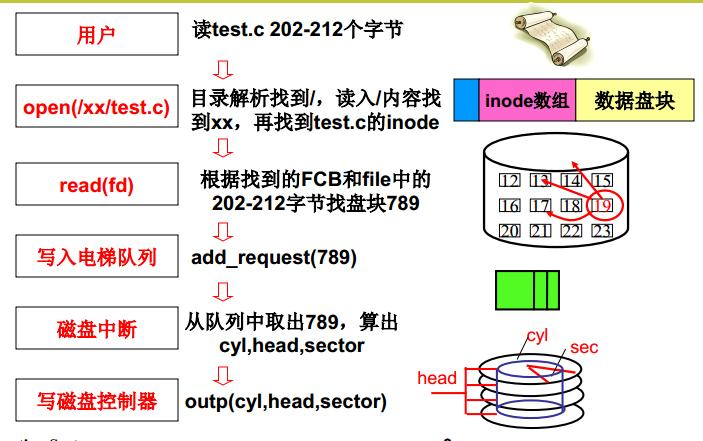
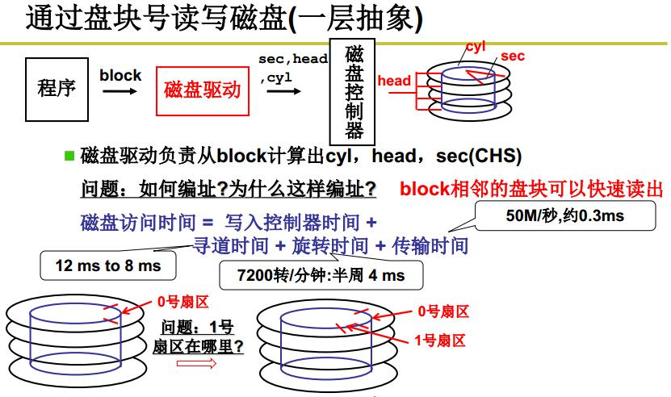
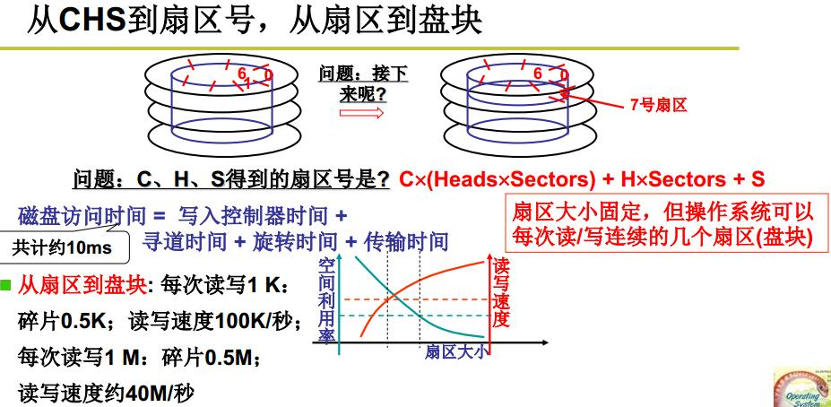
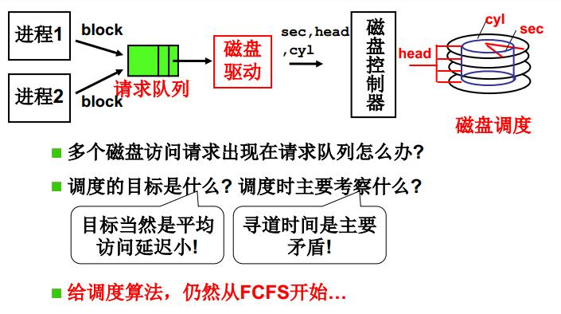
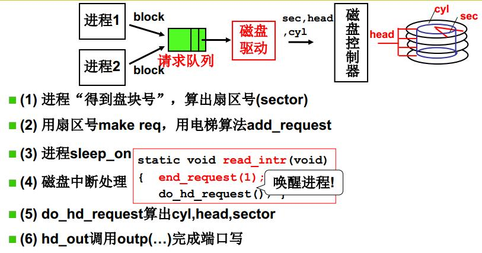
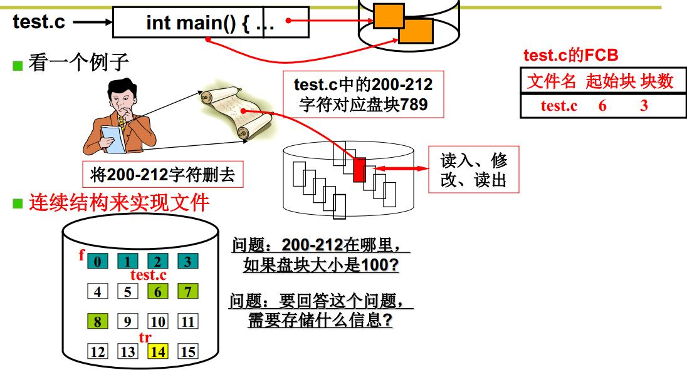
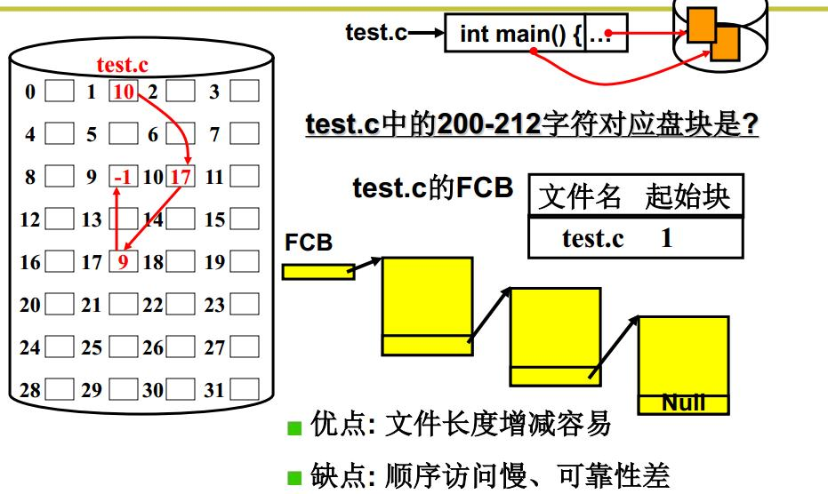
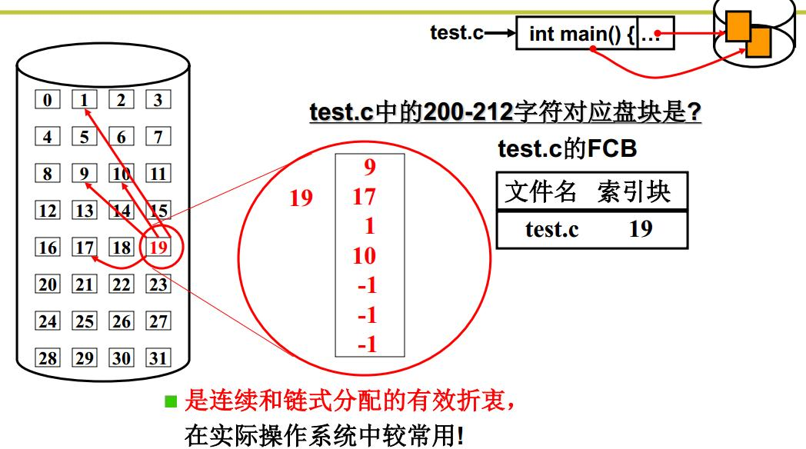
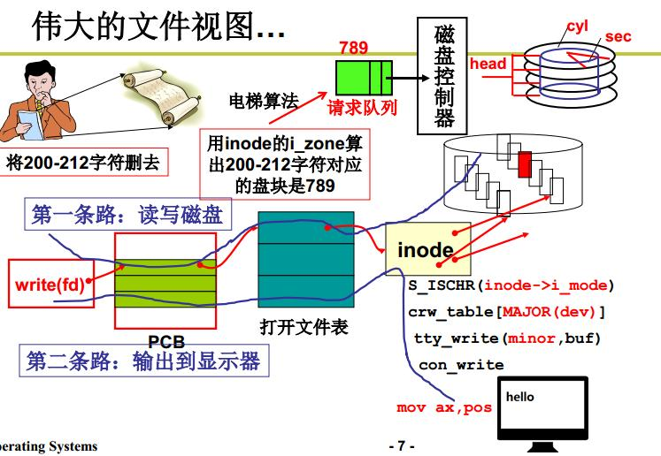

# 第四篇.操作系统之文件系统

## 一、 文件

操作系统中处理文件的部分称为**文件系统（file system）**。文件是进程创建的信息逻辑单元。

### 1、 文件命名

文件是一种抽象机制，它提供了一种在磁盘上保留信息而且方便以后读取的方法。
文件名用圆点隔开分为两部分，圆点后面的部分称为**文件扩展名（file extension）**，文件扩展名通常表示文件的一些信息。

### 2、 文件管理的逻辑结构

文件的逻辑结构是从用户的角度出发看到文件的组织形式；文件的物理结构(存储结构)是从实现观点出发看文件在外存上的存储形式。按照逻辑结构可以划分成无结构文件和有结构文件两种。

#### 无结构文件

无结构文件又叫做流式文件，将数据桉顺序组织、记录、积累保存，以字节(byte)为单位，是有序信息项的集合。因为没有结构，只能通过穷举搜索的方式查找，查找非常低效率。

#### 有结构文件

有结构文件按照记录的组成形式可以分成顺序文件、索引文件、索引顺序文件

##### 顺序文件

- 文件记录一个接一个的顺序排列，通常是定长的。顺序排列通常有两种：
- 串结构：按照记录之间的顺序排列与关键字无关，通常和时间有关。
- 顺序结构：文件中的记录按照关键字来排序。
- 特点：在文件中对记录批量修改，顺序文件效率较高，但是增删改查单条记录效率比较低。

##### 索引文件

- 索引文件就是建立一张索引表，如果是定长的记录索引表中只需要有索引号(按顺序排列，二分查找)和对应指向逻辑文件的指针，第i条记录的地址就是i*L(L是记录的定长)；如果是不定长的记录，索引表会有索引号(按顺序排列，二分查找)、记录长度和执行逻辑地址的指针，第i条记录的地址是钱i-1条记录地址之和+1。
- 特点：索引表可以提高访问速度，但是每个记录都会对应一个索引表项，如果索引表项比较大的，如果文件为8B，索引表项占32个字节这样对存储空间利用率太低了。

##### 索引顺序文件

- 索引顺序文件是指顺序和索引文件二者结合。将文件的所有记录分成若干组，为顺序文件建立一张索引表，在表中为每组的第一条记录建立索引项(该记录的关键字和指向该记录的指针)。查找的时候先根据索引表找到改组，然后在组中顺序查找。
- 提高了存取速度，减少了索引表的空间

### 3、 文件类型

**普通文件（regular file）**中包含有用户信息，**目录（directory）**是管理文件系统结构的系统文件，**字符特殊文件（character special file）**和输入/输出有关用于串行I/O设备如终端、打印机、网络等，**块特殊文件（block special file）**用于磁盘类设备。
普通文件一般分为ASCII文件和二进制文件。
ASCII文件由多行正文组成，每行用回车符、换行符结束，各行的长度不一定相同，最大优势是可以显示和打印，可以用任何文本编辑器进行编辑。二进制文件有一定的内部结构，打印出来是无法理解的。

### 4 、文件存取

**顺序存取（sequential access）**：进程可在系统中从头顺序读取文件的全部字节或记录，但不能跳过某一些内容，也不能不按顺序读取。
**随机存取文件（random access file）**：可以不按顺序读取字节或记录或者按照关键字而不是位置来存取记录，这种能够以任何次序读取其中字节或记录的文件。

### 5、 文件属性

文件都有文件名和数据，另外，操作系统还会保存其他与文件相关的信息，这些附加信息称为文件**属性（attribute）**或**元数据（metadata）**。如图：


### 6、 文件操作

1）creat。创建文件。
2）delete。删除文件以释放磁盘空间。
3）open。open的调用目的是把文件属性和磁盘地址表装入内存，便于后续调用的快速访问。
4）close。关闭文件以释放内部表空间。
5）read。在文件中读数据
6）write。从当前位置写数据。
7）append。在文件末尾追加数据。
8）seek。把当前位置指针指向文件中的特定位置。
9）get attributes。读取文件属性。
10）set attributes。设置文件属性。
11）rename。重命名文件。

## 二、 目录

文件系统通常提供**目录**或**文件夹**用于记录文件。

### 1、 一级目录系统

一级目录系统最简单形式是在一个目录中包含所有的文件，称为根目录。

### 2、 层次目录系统

通过层次结构目录（目录树）系统，可以用很多目录把文件以自然地方式分组。一个目录中可含有任意数量的文件与子目录。

### 3 、路径名

每个文件都赋予一个**绝对路径名（absolute path name）**，它由从根目录到文件的路径组成。
文件也可以使用一个**相对路径名（relative path name）**，常和**工作目录（working directory，也称作当前目录（current directory））**一起使用，用户可以指定一个目录作为当前目录，由从工作目录到文件的路径组成。

### 4 、目录操作

1）creat。创建目录。除了“.”和“⋯”外，目录内容为空。
2）delete。删除目录。只有空目录可以删除。
3）opendir。打开目录。和打开文件一样，在读目录前，必须打开目录。
4）closedir。关闭目录。以释放内部空间表。
5）readdir。返回目录的下一个目录项。
6）rename。重命名目录。
7）link。链接技术允许在多个目录中出现同一个文件，这个系统调用指定一个存在的文件和一个路径名，并建立从该文件到路径所指名字的链接。这是硬链接，这种链接增加了该文件的i节点计数器的计数（记录含有该目录项数目）。硬链接与软链接
8）unlink。如果被解除连接的文件只出现在一个目录中，则将它从系统中删除，如果他出现在多个目录中，则只删除指定路径名的链接，依然保持其他路径名的连接。

## 三、文件系统的实现

### 1、文件的使用

我们从用户角度来看文件的话，就是我们要怎么使用文件？首先，我们得通过系统调用来打开一个文件。

write 的过程

```c
fd = open(name, flag); # 打开文件
...
write(fd,...);         # 写数据
...
close(fd);             # 关闭文件
```

上面简单的代码是读取一个文件的过程：

- 首先用 `open` 系统调用打开文件，`open` 的参数中包含文件的路径名和文件名。
- 使用 `write` 写数据，其中 `write` 使用 `open` 所返回的**文件描述符**，并不使用文件名作为参数。
- 使用完文件后，要用 `close` 系统调用关闭文件，避免资源的泄露。

我们打开了一个文件后，操作系统会跟踪进程打开的所有文件，所谓的跟踪呢，就是操作系统为每个进程维护一个打开文件表，文件表里的每一项代表「**文件描述符**」，所以说文件描述符是打开文件的标识。

打开文件表

操作系统在打开文件表中维护着打开文件的状态和信息：

- 文件指针：系统跟踪上次读写位置作为当前文件位置指针，这种指针对打开文件的某个进程来说是唯一的；
- 文件打开计数器：文件关闭时，操作系统必须重用其打开文件表条目，否则表内空间不够用。因为多个进程可能打开同一个文件，所以系统在删除打开文件条目之前，必须等待最后一个进程关闭文件，该计数器跟踪打开和关闭的数量，当该计数为 0 时，系统关闭文件，删除该条目；
- 文件磁盘位置：绝大多数文件操作都要求系统修改文件数据，该信息保存在内存中，以免每个操作都从磁盘中读取；
- 访问权限：每个进程打开文件都需要有一个访问模式（创建、只读、读写、添加等），该信息保存在进程的打开文件表中，以便操作系统能允许或拒绝之后的 I/O 请求；

在用户视角里，文件就是一个持久化的数据结构，但操作系统并不会关心你想存在磁盘上的任何的数据结构，操作系统的视角是如何把文件数据和磁盘块对应起来。

所以，用户和操作系统对文件的读写操作是有差异的，用户习惯以字节的方式读写文件，而操作系统则是以数据块来读写文件，那屏蔽掉这种差异的工作就是文件系统了。

我们来分别看一下，读文件和写文件的过程：

- 当用户进程从文件读取 1 个字节大小的数据时，文件系统则需要获取字节所在的数据块，再返回数据块对应的用户进程所需的数据部分。
- 当用户进程把 1 个字节大小的数据写进文件时，文件系统则找到需要写入数据的数据块的位置，然后修改数据块中对应的部分，最后再把数据块写回磁盘。

所以说，**文件系统的基本操作单位是数据块**。

------

### 2、文件的存储

文件的数据是要存储在硬盘上面的，数据在磁盘上的存放方式，就像程序在内存中存放的方式那样，有以下两种：

- 连续空间存放方式
- 非连续空间存放方式

其中，非连续空间存放方式又可以分为「链表方式」和「索引方式」。

不同的存储方式，有各自的特点，重点是要分析它们的存储效率和读写性能，接下来分别对每种存储方式说一下。

#### 1.连续空间存放方式

连续空间存放方式顾名思义，**文件存放在磁盘「连续的」物理空间中**。这种模式下，文件的数据都是紧密相连，**读写效率很高**，因为一次磁盘寻道就可以读出整个文件。

使用连续存放的方式有一个前提，必须先知道一个文件的大小，这样文件系统才会根据文件的大小在磁盘上找到一块连续的空间分配给文件。

所以，**文件头里需要指定「起始块的位置」和「长度」**，有了这两个信息就可以很好的表示文件存放方式是一块连续的磁盘空间。

注意，此处说的文件头，就类似于 Linux 的 inode。

连续空间存放方式

连续空间存放的方式虽然读写效率高，**但是有「磁盘空间碎片」和「文件长度不易扩展」的缺陷。**

如下图，如果文件 B 被删除，磁盘上就留下一块空缺，这时，如果新来的文件小于其中的一个空缺，我们就可以将其放在相应空缺里。但如果该文件的大小大于所有的空缺，但却小于空缺大小之和，则虽然磁盘上有足够的空缺，但该文件还是不能存放。当然了，我们可以通过将现有文件进行挪动来腾出空间以容纳新的文件，但是这个在磁盘挪动文件是非常耗时，所以这种方式不太现实。

磁盘碎片

另外一个缺陷是文件长度扩展不方便，例如上图中的文件 A 要想扩大一下，需要更多的磁盘空间，唯一的办法就只能是挪动的方式，前面也说了，这种方式效率是非常低的。

那么有没有更好的方式来解决上面的问题呢？答案当然有，既然连续空间存放的方式不太行，那么我们就改变存放的方式，使用非连续空间存放方式来解决这些缺陷。

#### 2.非连续空间存放方式

非连续空间存放方式分为「链表方式」和「索引方式」。

> 我们先来看看链表的方式。

链表的方式存放是**离散的，不用连续的**，于是就可以**消除磁盘碎片**，可大大提高磁盘空间的利用率，同时**文件的长度可以动态扩展**。根据实现的方式的不同，链表可分为「**隐式链表**」和「**显式链接**」两种形式。

文件要以「**隐式链表**」的方式存放的话，**实现的方式是文件头要包含「第一块」和「最后一块」的位置，并且每个数据块里面留出一个指针空间，用来存放下一个数据块的位置**，这样一个数据块连着一个数据块，从链头开是就可以顺着指针找到所有的数据块，所以存放的方式可以是不连续的。

隐式链表

隐式链表的存放方式的**缺点在于无法直接访问数据块，只能通过指针顺序访问文件，以及数据块指针消耗了一定的存储空间**。隐式链接分配的**稳定性较差**，系统在运行过程中由于软件或者硬件错误**导致链表中的指针丢失或损坏，会导致文件数据的丢失。**

如果取出每个磁盘块的指针，把它放在内存的一个表中，就可以解决上述隐式链表的两个不足。那么，这种实现方式是「**显式链接**」，它指**把用于链接文件各数据块的指针，显式地存放在内存的一张链接表中**，该表在整个磁盘仅设置一张，**每个表项中存放链接指针，指向下一个数据块号**。

对于显式链接的工作方式，我们举个例子，文件 A 依次使用了磁盘块 4、7、2、10 和 12 ，文件 B 依次使用了磁盘块 6、3、11 和 14 。利用下图中的表，可以从第 4 块开始，顺着链走到最后，找到文件 A 的全部磁盘块。同样，从第 6 块开始，顺着链走到最后，也能够找出文件 B 的全部磁盘块。最后，这两个链都以一个不属于有效磁盘编号的特殊标记（如 -1 ）结束。内存中的这样一个表格称为**文件分配表（\*File Allocation Table，FAT\*）**。

显式链接

由于查找记录的过程是在内存中进行的，因而不仅显著地**提高了检索速度**，而且**大大减少了访问磁盘的次数**。但也正是整个表都存放在内存中的关系，它的主要的缺点是**不适用于大磁盘**。

比如，对于 200GB 的磁盘和 1KB 大小的块，这张表需要有 2 亿项，每一项对应于这 2 亿个磁盘块中的一个块，每项如果需要 4 个字节，那这张表要占用 800MB 内存，很显然 FAT 方案对于大磁盘而言不太合适。

#### 3.索引方式。

链表的方式解决了连续分配的磁盘碎片和文件动态扩展的问题，但是不能有效支持直接访问（FAT除外），索引的方式可以解决这个问题。

索引的实现是为每个文件创建一个「**索引数据块**」，里面存放的是**指向文件数据块的指针列表**，说白了就像书的目录一样，要找哪个章节的内容，看目录查就可以。

另外，**文件头需要包含指向「索引数据块」的指针**，这样就可以通过文件头知道索引数据块的位置，再通过索引数据块里的索引信息找到对应的数据块。

创建文件时，索引块的所有指针都设为空。当首次写入第 i 块时，先从空闲空间中取得一个块，再将其地址写到索引块的第 i 个条目。

索引的方式

索引的方式优点在于：

- 文件的创建、增大、缩小很方便；
- 不会有碎片的问题；
- 支持顺序读写和随机读写；

由于索引数据也是存放在磁盘块的，如果文件很小，明明只需一块就可以存放的下，但还是需要额外分配一块来存放索引数据，所以缺陷之一就是存储索引带来的开销。

如果文件很大，大到一个索引数据块放不下索引信息，这时又要如何处理大文件的存放呢？我们可以通过组合的方式，来处理大文件的存。

先来看看链表 + 索引的组合，这种组合称为「**链式索引块**」，它的实现方式是**在索引数据块留出一个存放下一个索引数据块的指针**，于是当一个索引数据块的索引信息用完了，就可以通过指针的方式，找到下一个索引数据块的信息。那这种方式也会出现前面提到的链表方式的问题，万一某个指针损坏了，后面的数据也就会无法读取了。

链式索引块

还有另外一种组合方式是索引 + 索引的方式，这种组合称为「**多级索引块**」，实现方式是**通过一个索引块来存放多个索引数据块**，一层套一层索引，像极了俄罗斯套娃是吧。

多级索引块

我们先把前面提到的文件实现方式，做个比较：


#### 4.i节点

最后一个记录各个文件分别包含哪些磁盘块的方法是给每个文件赋予一个称为**i节点（index-node）**的数据结构，其中列出了文件属性和文件块的磁盘地址。通常为了打开文件而保留的i节点的数组所占据的空间比FAT所占据的空间要少。

------

### 3、空闲空间管理

存储n个字节的文件可以有两种策略：分配n个字节的连续磁盘空间，或者把文件分成很多个连续（或并不一定连续）的块。

正如我们已经见到的，按连续字节序列存储文件有一个明显问题，当文件扩大时，有可能需要在磁盘上移动文件。内存中分段也有同样的问题。不同的是，相对于把文件从磁盘的一个位置移动到另一个位置，内存中段的移动操作要快得多。因此，几乎所有的文件系统都把文件分割成固定大小的块来存储，各块之间不一定相邻。

#### 1.块大小

##### 块大小

一旦决定把文件按固定大小的块来存储，就会出现一个问题：块的大小应该是多少？按照磁盘组织方式，扇区、磁道和柱面显然都可以作为分配单位（虽然它们都与设备相关，这是一种负面因素）。在分页系统中，页面大小也是主要讨论的问题之一。


#### 2.记录空闲块

前面说到的文件的存储是针对已经被占用的数据块组织和管理，接下来的问题是，如果我要保存一个数据块，我应该放在硬盘上的哪个位置呢？难道需要将所有的块扫描一遍，找个空的地方随便放吗？

那这种方式效率就太低了，所以针对磁盘的空闲空间也是要引入管理的机制，接下来介绍几种常见的方法：

- 空闲表法
- 空闲链表法
- 位图法

##### 空闲表法

空闲表法就是为所有空闲空间建立一张表，表内容包括空闲区的第一个块号和该空闲区的块个数，注意，这个方式是连续分配的，就是把每个文件作为一连串连续数据块存储在磁盘上。当请求分配磁盘空间时，系统依次扫描空闲表里的内容，直到找到一个合适的空闲区域为止。当用户撤销一个文件时，系统回收文件空间。这时，也需顺序扫描空闲表，寻找一个空闲表条目并将释放空间的第一个物理块号及它占用的块数填到这个条目中。连续分配有两大优势：
1)实现简单，记录每个文件用到的磁盘块简化为只需记住两个数字即可：第一个磁盘块地址和文件的块数；
2)读操作性能较好，因为在单个操作中就可以从磁盘上读出整个文件，只需要一次寻找（对第一个块），之后不再需要寻道和旋转延迟，所以数据以磁盘全带宽的速率输入。

但是**这一方法导致出现很多磁盘碎片**。这种方法仅当有少量的空闲区时才有较好的效果。因为，如果存储空间中有着大量的小的空闲区，则空闲表变得很大，这样查询效率会很低。另外，这种分配技术适用于建立连续文件。随着CD-ROM、DVD以及其他一次性写光学介质的出现，连续分配又成为一个好主意。

如下图：


##### 空闲链表法

可以为每个文件构造磁盘块链表，每个块的第一个字作为指向下一块的指针，块的其他部分存放数据。这一方法可以充分利用每个磁盘块，不会因为磁盘碎片而浪费存储空间。这一方法虽然顺序读文件非常方便，但是随机存取却相当缓慢。
在内存中采用表的链表分配
取出每个磁盘块的指针字，把它放在内存的一个表中，这样的一个表格称为文件分配表（File Allocation Table，FAT）。这一方法随机存取容易得多，但是对于大磁盘而言不太合适，因为这样FAT会很大。如下图：


空闲链表法

当创建文件需要一块或几块时，就从链头上依次取下一块或几块。反之，当回收空间时，把这些空闲块依次接到链头上。

这种技术只要在主存中保存一个指针，令它指向第一个空闲块。其特点是简单，但不能随机访问，工作效率低，因为每当在链上增加或移动空闲块时需要做很多 I/O 操作，同时数据块的指针消耗了一定的存储空间。

空闲表法和空闲链表法都不适合用于大型文件系统，因为这会使空闲表或空闲链表太大。

##### 位图法

位图是利用二进制的一位来表示磁盘中一个盘块的使用情况，磁盘上所有的盘块都有一个二进制位与之对应。

当值为 0 时，表示对应的盘块空闲，值为 1 时，表示对应的盘块已分配。它形式如下：

```
1111110011111110001110110111111100111 ...
```

在 Linux 文件系统就采用了位图的方式来管理空闲空间，不仅用于数据空闲块的管理，还用于 inode 空闲块的管理，因为 inode 也是存储在磁盘的，自然也要有对其管理。

------

### 4、文件系统的结构

前面提到 Linux 是用位图的方式管理空闲空间，用户在创建一个新文件时，Linux 内核会通过 inode 的位图找到空闲可用的 inode，并进行分配。要存储数据时，会通过块的位图找到空闲的块，并分配，但仔细计算一下还是有问题的。

数据块的位图是放在磁盘块里的，假设是放在一个块里，一个块 4K，每位表示一个数据块，共可以表示 `4 * 1024 * 8 = 2^15` 个空闲块，由于 1 个数据块是 4K 大小，那么最大可以表示的空间为 `2^15 * 4 * 1024 = 2^27` 个 byte，也就是 128M。

也就是说按照上面的结构，如果采用「一个块的位图 + 一系列的块」，外加「一个块的 inode 的位图 + 一系列的 inode 的结构」能表示的最大空间也就 128M，这太少了，现在很多文件都比这个大。

在 Linux 文件系统，把这个结构称为一个**块组**，那么有 N 多的块组，就能够表示 N 大的文件。

下图给出了 Linux Ext2 整个文件系统的结构和块组的内容，文件系统都由大量块组组成，在硬盘上相继排布：


最前面的第一个块是引导块，在系统启动时用于启用引导，接着后面就是一个一个连续的块组了，块组的内容如下：

- *超级块*，包含的是文件系统的重要信息，比如 inode 总个数、块总个数、每个块组的 inode 个数、每个块组的块个数等等。
- *块组描述符*，包含文件系统中各个块组的状态，比如块组中空闲块和 inode 的数目等，每个块组都包含了文件系统中「所有块组的组描述符信息」。
- *数据位图和 inode 位图*， 用于表示对应的数据块或 inode 是空闲的，还是被使用中。
- *inode 列表*，包含了块组中所有的 inode，inode 用于保存文件系统中与各个文件和目录相关的所有元数据。
- *数据块*，包含文件的有用数据。

你可以会发现每个块组里有很多重复的信息，比如**超级块和块组描述符表，这两个都是全局信息，而且非常的重要**，这么做是有两个原因：

- 如果系统崩溃破坏了超级块或块组描述符，有关文件系统结构和内容的所有信息都会丢失。如果有冗余的副本，该信息是可能恢复的。
- 通过使文件和管理数据尽可能接近，减少了磁头寻道和旋转，这可以提高文件系统的性能。

不过，Ext2 的后续版本采用了稀疏技术。该做法是，超级块和块组描述符表不再存储到文件系统的每个块组中，而是只写入到块组 0、块组 1 和其他 ID 可以表示为 3、 5、7 的幂的块组中。

### 5、文件系统的基本组成（重要）

#### 1.组成

文件系统是操作系统中负责管理持久数据的子系统，说简单点，就是负责把用户的文件存到磁盘硬件中，因为即使计算机断电了，磁盘里的数据并不会丢失，所以可以持久化的保存文件。文件系统的基本数据单位是文件，它的目的是对磁盘上的文件进行组织管理，那组织的方式不同，就会形成不同的文件系统。

Linux 最经典的一句话是：**「一切皆文件」**，不仅普通的文件和目录，就连块设备、管道、socket 等，也都是统一交给文件系统管理的。

Linux 文件系统会为每个文件分配两个数据结构：**索引节点（\*index node\*）和目录项（\*directory entry\*）（FCB）**，它们主要用来记录文件的元信息和目录层次结构。

- 索引节点，也就是 *inode*，用来记录文件的元信息，比如 inode 编号、文件大小、访问权限、创建时间、修改时间、**数据在磁盘的位置**等等。索引节点是文件的**唯一**标识，它们之间一一对应，也同样都会被存储在硬盘中，所以**索引节点同样占用磁盘空间**。
- 目录项（FCB），也就是 *dentry*，用来记录文件的名字、**索引节点指针**以及与其他目录项的层级关联关系。多个目录项关联起来，就会形成目录结构，但它与索引节点不同的是，**目录项是由内核维护的一个数据结构，不存放于磁盘，而是缓存在内存**。

由于索引节点唯一标识一个文件，而目录项记录着文件的名，所以目录项和索引节点的关系是多对一，也就是说，一个文件可以有多个别字。比如，硬链接的实现就是多个目录项中的索引节点指向同一个文件。

注意，目录也是文件，也是用索引节点唯一标识，和普通文件不同的是，普通文件在磁盘里面保存的是文件数据，而目录文件在磁盘里面保存子目录或文件。

以上就是索引节点、目录项以及文件数据的关系，下面这个图就很好的展示了它们之间的关系：
.png)

**如上图，绿色为内存中，其余为外存，内存中的索引节点指针找到磁盘上i节点区的对应i节点，然后通过i节点找到对应的数据块。**

索引节点是存储在硬盘上的数据，那么为了加速文件的访问，通常会把索引节点加载到内存中。另外，磁盘进行格式化的时候，会被分成三个存储区域，分别是超级块、索引节点区和数据块区。

- *超级块*，用来存储文件系统的详细信息，比如块个数、块大小、空闲块等等。
- *索引节点区*，用来存储索引节点；
- *数据块区*，用来存储文件或目录数据；

我们不可能把超级块和索引节点区全部加载到内存，这样内存肯定撑不住，所以只有当需要使用的时候，才将其加载进内存，它们加载进内存的时机是不同的：

- 超级块：当文件系统挂载时进入内存；
- 索引节点区：当文件被访问时进入内存；

#### 2.**几个关键问题**

> 目录项和目录是一个东西吗？

虽然名字很相近，但是它们不是一个东西，目录是个文件，持久化存储在磁盘，而目录项是内核一个数据结构，缓存在内存。

如果查询目录频繁从磁盘读，效率会很低，所以**内核会把已经读过的目录用目录项这个数据结构缓存在内存**，下次再次读到相同的目录时，只需从内存读就可以，大大提高了文件系统的效率。

注意，目录项这个数据结构不只是表示目录，也是可以表示文件的。

> 那文件数据是如何存储在磁盘的呢？（从盘块到扇区）

磁盘读写的最小单位是**扇区**，扇区的大小只有 `512B` 大小，很明显，如果每次读写都以这么小为单位，那这读写的效率会非常低。所以，文件系统把多个扇区组成了一个**逻辑块**，每次读写的最小单位就是逻辑块（数据块），Linux 中的逻辑块大小为 `4KB`，也就是一次性读写 8 个扇区，这将大大提高了磁盘的读写的效率。

> 我的理解是通过索引节点指针找到索引节点，根据索引节点可以找到一个数据块，但是文件内容可能存在多个数据块上，那么其他数据块需要怎么找到呢？

当文件数据量大的时候，索引节点指向的是索引表，然后再通过一级一级的索引表找到所有的文件数据。如下图：

早期 Unix 文件系统

它是根据文件的大小，存放的方式会有所变化：

- 如果存放文件所需的数据块小于 10 块，则采用直接查找的方式；
- 如果存放文件所需的数据块超过 10 块，则采用一级间接索引方式；
- 如果前面两种方式都不够存放大文件，则采用二级间接索引方式；
- 如果二级间接索引也不够存放大文件，这采用三级间接索引方式；

那么，文件头（*Inode*）就需要包含 13 个指针：

- 10 个指向数据块的指针；
- 第 11 个指向索引块的指针；
- 第 12 个指向二级索引块的指针；
- 第 13 个指向三级索引块的指针；

所以，这种方式能很灵活地支持小文件和大文件的存放：

- 对于小文件使用直接查找的方式可减少索引数据块的开销；
- 对于大文件则以多级索引的方式来支持，所以大文件在访问数据块时需要大量查询；

这个方案就用在了 Linux Ext 2/3 文件系统里，虽然解决大文件的存储，但是对于大文件的访问，需要大量的查询，效率比较低。

为了解决这个问题，Ext 4 做了一定的改变，具体怎么解决的，本文就不展开了。

------

### 6、目录的实现（重要）

#### 1.i节点（索引节点）

inode包含文件的元信息，具体来说有以下内容：

　　* 文件的字节数

　　* 文件拥有者的User ID

　　* 文件的Group ID

　　* 文件的读、写、执行权限

　　* 文件的时间戳，共有三个：ctime指inode上一次变动的时间，mtime指文件内容上一次变动的时间，atime指文件上一次打开的时间。

　　* 链接数，即有多少文件名指向这个inode

　　* 该文件所有数据盘块的位置

**每个inode都有一个号码，操作系统用inode号码来识别不同的文件。这里值得重复一遍，Unix/Linux系统内部不使用文件名，而使用inode号码来识别文件。对于系统来说，文件名只是inode号码便于识别的别称或者绰号。**

**表面上，用户通过文件名，打开文件。实际上，系统内部这个过程分成三步：首先，系统找到这个文件名对应的inode号码；其次，通过inode号码，获取inode信息；最后，根据inode信息，找到文件数据所在的block，读出数据。**

#### 2. 文件控制块FCB（目录项）

　　为了能对文件进行正确的存取，必须为文件设置用于描述和控制文件的数据结构，称之为文件控制块FCB，文件管理程序可借助于文件控制块中的信息，对文件施加各种操作，文件与文件控制块一一对应，而人们把文件控制块的有序集合称为文件目录，**一个文件控制块就是一个文件目录项**。通常，一个文件目录也可被看成是一个文件，称为目录文件。**但目录查询是通过在磁盘上反复搜索完成，需要不断地进行 I/O 操作，开销较大。所以，为了减少 I/O 操作，把当前使用的文件目录缓存在内存（FCB），以后要使用该文件时只要在内存中操作，从而降低了磁盘操作次数，提高了文件系统的访问速度。**
　　① 基本信息，包括文件名（标识一个文件的符号名，在每个系统中，每个文件都有唯一的名字，用户利用该名字进行存取）；文件物理位置（指文件在外存上的存储位置，包括存放文件的设备名、文件在外村上的起始盘块号、指示文件所占用的盘块数或字节数的文件长度）；文件逻辑结构（指示文件是流式文件还是记录式文件、记录数，文件是定长还是变长记录）；文件物理结构（指示文件是顺序文件、链式文件还是索引文件）
　　② 存取控制信息，包括文件主的存取权限、核准用户的存取权限及一般用户的存取权限。
　　③ 使用信息，包括文件的建立日期和时间、文件上一次修改的日期和时间及当前使用信息（这项信息包括当前已打开该文件的进程数、是否被其他进程锁住、文件在内存中是否已被修改但尚未拷贝到盘上）
每个文件都有唯一的磁盘索引结点（磁盘索引结点信息与文件名等信息一起构成了FCB）

#### 3.目录的存储

在前面，我们知道了一个普通文件是如何存储的，但还有一个特殊的文件，经常用到的目录，它是如何保存的呢？

基于 Linux 一切皆文件的设计思想，目录其实也是个文件，你甚至可以通过 `vim` 打开它，它也有 inode，inode 里面也是指向一些块。
和普通文件不同的是，**普通文件的块里面保存的是文件数据，而目录文件的块里面保存的是目录里面一项一项的文件信息。**
在目录文件的块中，最简单的保存格式就是**列表**，就是一项一项地将目录下的文件信息（如文件名、文件 inode、文件类型等）列在表里。列表中每一项就代表该目录下的文件的文件名和对应的 inode，通过这个 inode，就可以找到真正的文件。通常，第一项是「`.`」，表示当前目录，第二项是「`..`」，表示上一级目录，接下来就是一项一项的文件名和 inode。


#### 4、查找目录的方式（在i节点区进行查找）

**当用户要访问一个已存在的文件时，系统首先利用用户提供的文件名对目录进行查询，找出该文件的文件控制块(目录项)或对应索引结点，然后，根据文件控制块(目录项)或索引结点中所记录的文件物理地址（盘块号），换算出文件在磁盘上的物理位置，最后，再通过磁盘驱动程序，将所需文件读入内存。**目前常用的方式有线性检索法和Hash方法。

到目前为止，在需要查找文件名时，所有的方案都是线性的从头到尾对目录进行搜索。如果一个目录有超级多的文件，我们要想在这个目录下找文件，按照列表一项一项的找，效率就不高了。于是，保存目录的格式改成**哈希表**，对文件名进行哈希计算，把哈希值保存起来，如果我们要查找一个目录下面的文件名，可以**通过名称取哈希**。如果哈希能够匹配上，就说明这个文件的信息在相应的块里面。
**散列表（哈希表）**：设表的大小为n。在输入文件名时，文件名被散列到1和n-1之间的一个值，添加文件时，不论哪种方法都要对散列值相对应的散列表进行检查。如果该表项没有被使用，就将一个指向文件目录项的指针放入，文件目录项紧连在散列表后面。如果该表项被使用了，就构造一个链表，该链表的表头指针存放在该表项中，并连接所有具有相同散列值的文件目录项。查找文件按照相同的过程进行。散列处理文件名，以便选择一个散列表项。检查链表头在该位置上的链表的所有表项，查找要找的文件是否存在。如果名字不在该链上，该文件就不在这个目录中。通过这种方法只能找到对应文件名的文件，并不能知道该文件真正存储的盘块号，要想知道文件在数据区真正的盘块号，需要看该文件的inode节点内的信息。这种查找方式只是在inode列表中进行。Linux 系统的 ext 文件系统就是采用了哈希表，来保存目录的内容，这种方法的优点是查找非常迅速，插入和删除也较简单，不过需要一些预备措施来避免哈希冲突。
**高速缓存**：在开始查找之前，先查看文件名是否在高速缓存中，如果是，该文件可以立即被定位，当然只有在查询目标集中在相对小范围的文件集合的时候，高速缓存的方案才有效。

#### 5、两种长文件名的处理方案

最简单的方法是给文件名一个限制,限制在255.但是这种方法会浪费大量存储空间.
另一种方法是每个目录项都变长.这种方法中,每个目录项有一个固定部分,这个固定部分通常以目录项的长度开始,后面是固定格式的数据,通常包括所有者,创建时间,保护信息等.这个固定长度的头后面是实际文件名.坑能耐是正序放置,如图:


每个文件名以一个特殊字符(通常是0)结束.为了是目录项正好充满边界,每个文件名被填充为整数个字.(图中阴影).


这种方法有两个问题

1. 移走文件后,就留下一个大小可变的空隙,下一个进来的不一定正好填满.
2. 另一个问题是,一个目录项坑内分布在不同页面上,读取文件名可能发生缺页故障.

另一个方法是每个目录项都有固定长度,文件名放在最后的堆中,目录项中用一个指针指向堆中文件名.
当一个文件目录项被移走时,另一个文件目录项总是可以填满这个空.当然还是要对堆进行管理,读取文件名时,还是可能发生缺页中断.

------

### 7、共享文件

有时候我们希望给某个文件取个别名，那么在 Linux 中可以通过**硬链接（\*Hard Link\*）** 和**软链接（\*Symbolic Link\*）** 的方式来实现，它们都是比较特殊的文件，但是实现方式也是不相同的。

硬链接是**多个目录项中的「索引节点」指向一个文件**，也就是指向同一个 inode，但是 inode 是不可能跨越文件系统的，每个文件系统都有各自的 inode 数据结构和列表，所以**硬链接是不可用于跨文件系统的**。由于多个目录项都是指向一个 inode，那么**只有删除文件的所有硬链接以及源文件时，系统才会彻底删除该文件。**

硬链接

软链接相当于重新创建一个文件，这个文件有**独立的 inode**，但是这个**文件的内容是另外一个文件的路径**，所以访问软链接的时候，实际上相当于访问到了另外一个文件，所以**软链接是可以跨文件系统的**，甚至**目标文件被删除了，链接文件还是在的，只不过指向的文件找不到了而已。**

软链接

------


### 8、 日志结构文件系统

为解决磁盘寻道时间较长的问题而设计了日志结构文件系统（Log-structured File System，LFS）。UNIX文件系统的基本思想是将整个磁盘结构化为一个日志，每隔一段时间或是有特殊需要，被缓冲在内存中的所有未决的写操作都被放到一个单独的段中，作为在日志末尾的一个邻接段写入磁盘，一个单独的段可能会包括i节点、目录块、数据块或者都有，每一个段的开始都是该段的摘要，说明该段中都包含哪些内容。LFS的i节点分散在整个日志中而不是放在磁盘的某一个固定位置，为了能够找到i节点，必须维护一个由i节点编号索引组成的i节点图保存在磁盘上也保存在高速缓存中，但是磁盘空间有限，需要一个清理线程周期地扫描日志进行磁盘压缩。

### 9、日志文件系统

LFS和现有的文件系统不相匹配，，所以还没有被广泛应用，但是其内在的一个思想，即面对出错的鲁棒性，却可以被其他文件系统所借鉴，这里的基本思想是保存一个用于记录系统下一步将要做什么的日志，这样当系统在完成它们即将完成的任务前崩溃时，重新启动后，可以通过查看日志，获取崩溃前计划完成的任务，并完成它们，这样的文件系统被称为日志文件系统（Journaling File System，JFS），并已被实际应用。
移除文件需要在目录中删除文件、释放i节点到空闲i节点池、将所有磁盘块归还空闲磁盘块池，但是一旦系统崩溃，崩溃前执行到不同步骤会导致不同问题，需要用日志去记录。为了增加可信性，一个文件系统可以引入数据库中原子事务（atomic transaction）的概念，使用这个概念，一组动作可以被界定在开始事务和结束事务操作之间，这样，文件系统就会知道它必须完成所有被界定的操作，或者什么也不做，但是没有其他的选择。

### 10、虚拟文件系统

文件系统的种类众多，而操作系统希望**对用户提供一个统一的接口**，于是在用户层与文件系统层引入了中间层，这个中间层就称为**虚拟文件系统（\*Virtual File System，VFS\*）。**

VFS 定义了一组所有文件系统都支持的数据结构和标准接口，这样程序员不需要了解文件系统的工作原理，只需要了解 VFS 提供的统一接口即可。

在 Linux 文件系统中，用户空间、系统调用、虚拟机文件系统、缓存、文件系统以及存储之间的关系如下图：


Linux 支持的文件系统也不少，根据存储位置的不同，可以把文件系统分为三类：

- *磁盘的文件系统*，它是直接把数据存储在磁盘中，比如 Ext 2/3/4、XFS 等都是这类文件系统。
- *内存的文件系统*，这类文件系统的数据不是存储在硬盘的，而是占用内存空间，我们经常用到的 `/proc` 和 `/sys` 文件系统都属于这一类，读写这类文件，实际上是读写内核中相关的数据数据。
- *网络的文件系统*，用来访问其他计算机主机数据的文件系统，比如 NFS、SMB 等等。

文件系统首先要先挂载到某个目录才可以正常使用，比如 Linux 系统在启动时，会把文件系统挂载到根目录。

### 11、 文件系统备份

#### 1.物理转储

从磁盘的第0块开始，将全部的磁盘块按需输出，直到最后一块复制完毕。对于未使用的磁盘块不需要备份，如果转储程序能够访问管理空闲块的数据结构，就可以避免备份未使用的磁盘块。要注意的是原磁盘和得到备份的磁盘块并不是一一对应的，所以应该在每个磁盘块前写上磁盘块号码。另一方面需要关注的是坏块的转储。可以通过建立一个包含所有坏块的“文件”来解决，以确保这些坏块不会被使用和分配。所以在转储时，需要跳过这些块。物理存储的优点是简单，快速，但是不能跳过选定的目录，也不能增量转储。

#### 2.逻辑转储

从一个或几个指定的目录开始，递归地转储其自给定基准日期（如最近一次转储的日期）后所更改的全部文件和目录。在逻辑存储中，得到转储的磁盘会有一连串被标识过得目录和文件，可以按要求恢复特定文件或目录。


### 11、 文件系统的一致性

一致性检查分为两种：块的一致性检查和文件的一致性检查。
检查块的一致性时，程序构造两张表，每张表为每一个块设立一个计数器，初始为0，第一个表中的计数器跟踪该块在文件中出现的次数，第二个表中的计数器跟踪该块在空闲表中出现的次数。接着检验程序使用原始设备读取全部i节点，从0开始。由i节点开始，可以建立相应文件中采用的全部块的块号表。每当读到一个块时，该块在第一个表中计数器加1。然后，程序检查空闲表或空闲位图，每当一个块未使用时，在第二张表中加1。检查完成后可能出现结果：一致，即每一块要么在第一个表计数器为1，要么在第二个表计数器为1；如果一个磁盘块在任何一张表中都是0，那么就称该块块丢失，解决方法是，检验程序将该块加入到空闲表中；一个块在空闲表中出现了两次，即一个块在第二张表中数字为2，解决方法是，重新建立空闲表；两个或多个文件中出现同一个数据块，即一个块在第一张表中数字为2，解决方法是，先分配一空闲块，将这个重复块的内容复制到空闲块中，然后把它插入到其中一个文件中。
检查文件的一致性时，检验程序检查目录系统，同样创建一张计数表，但每个文件而不是一个块对应一个计数器。程序从根目录开始检验，沿着目录树递归，检查文件系统中的每个目录。对每个目录中的每个文件，将文件使用计数器加1。遇到硬连接，同样加一，但是符号连接不计数。检验完成后，会得到一张由i节点号索引的表，说明每个文件被多少个目录包含。然后，检验程序将这些数字与存储在文件i节点中的连接数目比较。检查完成后可能出现结果：i节点连接数与计数器相等，则说明文件系统一致；i节点连接数大于计数器个数，说明即使所有该文件都被删除，计数仍是非0，i节点不会被删除，解决方法是，将i节点的值更新为计数器的值；i节点连接数小于计数器个数，可能导致一个目录指向错误i节点，解决方法同样是更新i节点值。

### 12、文件系统性能

#### 1.高速缓存

最常用的减少磁盘访问次数技术是高速缓存或者缓冲区高速缓存。管理高速缓存有不同的算法，常用的算法是：检查全部的读请求，查看在高速缓存中是否有所需要的块。如果存在，可执行读操作而无需访问磁盘。如果该块不在高速缓存中，首先要把它读到高速缓存，再复制到所需地方。之后，对同一个请求都通过高速缓存完成。

### 2.块提前读

在需要用到块之前，试图提前将其读入高速缓存，从而提高命中率。块提前读策略只适用于顺序读取的文件。对随机读取文件不起作用。

### 3、减少磁盘臂运动：

把有可能顺序存取的块放在一起，最好是一个柱面上，以减少磁盘臂的移动次数。对于位图保存空闲块的系统来说，可以很简单的找到最近的空闲块。对于使用空闲表的系统，需要使用块簇技术，即不用块，而是连续块簇来跟踪存储区。

### 4、磁盘碎片整理

移动文件使它们相邻，并把所有的空闲空间放在一个或多个大的连续的区域内。磁盘碎片整理程序会在一个在分区末端区域内有适量空闲空间的文件系统上很好地运行。

## 四、文件 I/O

文件的读写方式各有千秋，对于文件的 I/O 分类也非常多，常见的有

- 缓冲与非缓冲 I/O
- 直接与非直接 I/O
- 阻塞与非阻塞 I/O VS 同步与异步 I/O

接下来，分别对这些分类讨论讨论。

#### 1.缓冲与非缓冲 I/O

文件操作的标准库是可以实现数据的缓存，那么**根据「是否利用标准库缓冲」，可以把文件 I/O 分为缓冲 I/O 和非缓冲 I/O**：

- 缓冲 I/O，利用的是标准库的缓存实现文件的加速访问，而标准库再通过系统调用访问文件。
- 非缓冲 I/O，直接通过系统调用访问文件，不经过标准库缓存。

这里所说的「缓冲」特指标准库内部实现的缓冲。

比方说，很多程序遇到换行时才真正输出，而换行前的内容，其实就是被标准库暂时缓存了起来，这样做的目的是，减少系统调用的次数，毕竟系统调用是有 CPU 上下文切换的开销的。

#### 2.直接与非直接 I/O

我们都知道磁盘 I/O 是非常慢的，所以 Linux 内核为了减少磁盘 I/O 次数，在系统调用后，会把用户数据拷贝到内核中缓存起来，这个内核缓存空间也就是「页缓存」，只有当缓存满足某些条件的时候，才发起磁盘 I/O 的请求。

那么，**根据是「否利用操作系统的缓存」，可以把文件 I/O 分为直接 I/O 与非直接 I/O**：

- 直接 I/O，不会发生内核缓存和用户程序之间数据复制，而是直接经过文件系统访问磁盘。
- 非直接 I/O，读操作时，数据从内核缓存中拷贝给用户程序，写操作时，数据从用户程序拷贝给内核缓存，再由内核决定什么时候写入数据到磁盘。

如果你在使用文件操作类的系统调用函数时，指定了 `O_DIRECT` 标志，则表示使用直接 I/O。如果没有设置过，默认使用的是非直接 I/O。

> 如果用了非直接 I/O 进行写数据操作，内核什么情况下才会把缓存数据写入到磁盘？

以下几种场景会触发内核缓存的数据写入磁盘：

- 在调用 `write` 的最后，当发现内核缓存的数据太多的时候，内核会把数据写到磁盘上；
- 用户主动调用 `sync`，内核缓存会刷到磁盘上；
- 当内存十分紧张，无法再分配页面时，也会把内核缓存的数据刷到磁盘上；
- 内核缓存的数据的缓存时间超过某个时间时，也会把数据刷到磁盘上；

#### 3.阻塞与非阻塞 I/O VS 同步与异步 I/O

为什么把阻塞 / 非阻塞与同步与异步放一起说的呢？因为它们确实非常相似，也非常容易混淆，不过它们之间的关系还是有点微妙的。

先来看看**阻塞 I/O**，当用户程序执行 `read` ，线程会被阻塞，一直等到内核数据准备好，并把数据从内核缓冲区拷贝到应用程序的缓冲区中，当拷贝过程完成，`read` 才会返回。

注意，**阻塞等待的是「内核数据准备好」和「数据从内核态拷贝到用户态」这两个过程**。过程如下图：

阻塞 I/O

知道了阻塞 I/O ，来看看**非阻塞 I/O**，非阻塞的 read 请求在数据未准备好的情况下立即返回，可以继续往下执行，此时应用程序不断轮询内核，直到数据准备好，内核将数据拷贝到应用程序缓冲区，`read` 调用才可以获取到结果。过程如下图：

非阻塞 I/O

注意，**这里最后一次 read 调用，获取数据的过程，是一个同步的过程，是需要等待的过程。这里的同步指的是内核态的数据拷贝到用户程序的缓存区这个过程。**

举个例子，访问管道或 socket 时，如果设置了 `O_NONBLOCK` 标志，那么就表示使用的是非阻塞 I/O 的方式访问，而不做任何设置的话，默认是阻塞 I/O。

应用程序每次轮询内核的 I/O 是否准备好，感觉有点傻乎乎，因为轮询的过程中，应用程序啥也做不了，只是在循环。

为了解决这种傻乎乎轮询方式，于是 **I/O 多路复用**技术就出来了，如 select、poll，它是通过 I/O 事件分发，当内核数据准备好时，再以事件通知应用程序进行操作。

这个做法大大改善了应用进程对 CPU 的利用率，在没有被通知的情况下，应用进程可以使用 CPU 做其他的事情。

下图是使用 select I/O 多路复用过程。注意，`read` 获取数据的过程（数据从内核态拷贝到用户态的过程），也是一个**同步的过程**，需要等待：

I/O 多路复用

实际上，无论是阻塞 I/O、非阻塞 I/O，还是基于非阻塞 I/O 的多路复用**都是同步调用。因为它们在 read 调用时，内核将数据从内核空间拷贝到应用程序空间，过程都是需要等待的，也就是说这个过程是同步的，如果内核实现的拷贝效率不高，read 调用就会在这个同步过程中等待比较长的时间。**

而真正的**异步 I/O** 是「内核数据准备好」和「数据从内核态拷贝到用户态」这两个过程都不用等待。

当我们发起 `aio_read` 之后，就立即返回，内核自动将数据从内核空间拷贝到应用程序空间，这个拷贝过程同样是异步的，内核自动完成的，和前面的同步操作不一样，应用程序并不需要主动发起拷贝动作。过程如下图：

异步 I/O

下面这张图，总结了以上几种 I/O 模型：


在前面我们知道了，I/O 是分为两个过程的：

1. 数据准备的过程
2. 数据从内核空间拷贝到用户进程缓冲区的过程

阻塞 I/O 会阻塞在「过程 1 」和「过程 2」，而非阻塞 I/O 和基于非阻塞 I/O 的多路复用只会阻塞在「过程 2」，所以这三个都可以认为是同步 I/O。

异步 I/O 则不同，「过程 1 」和「过程 2 」都不会阻塞。

> 用故事去理解这几种 I/O 模型

举个你去饭堂吃饭的例子，你好比用户程序，饭堂好比操作系统。

阻塞 I/O 好比，你去饭堂吃饭，但是饭堂的菜还没做好，然后你就一直在那里等啊等，等了好长一段时间终于等到饭堂阿姨把菜端了出来（数据准备的过程），但是你还得继续等阿姨把菜（内核空间）打到你的饭盒里（用户空间），经历完这两个过程，你才可以离开。

非阻塞 I/O 好比，你去了饭堂，问阿姨菜做好了没有，阿姨告诉你没，你就离开了，过几十分钟，你又来饭堂问阿姨，阿姨说做好了，于是阿姨帮你把菜打到你的饭盒里，这个过程你是得等待的。

基于非阻塞的 I/O 多路复用好比，你去饭堂吃饭，发现有一排窗口，饭堂阿姨告诉你这些窗口都还没做好菜，等做好了再通知你，于是等啊等（`select` 调用中），过了一会阿姨通知你菜做好了，但是不知道哪个窗口的菜做好了，你自己看吧。于是你只能一个一个窗口去确认，后面发现 5 号窗口菜做好了，于是你让 5 号窗口的阿姨帮你打菜到饭盒里，这个打菜的过程你是要等待的，虽然时间不长。打完菜后，你自然就可以离开了。

异步 I/O 好比，你让饭堂阿姨将菜做好并把菜打到饭盒里后，把饭盒送到你面前，整个过程你都不需要任何等待。

## 五、四层抽象

总结一下磁盘的使用：多进程需要读写→通过文件系统（第四层抽象）目录解析找到test.c文件，根据文件（第三层抽象）的FCB得到所需位置的盘块号→盘块号写入请求队列排队（第二层抽象）进行电梯算法→磁盘驱动根据盘块号（第一层抽象）算出C H S→相应扇区读写。下面开始一层一层的抽象开始讲解。

**路径名-->FCB-->盘块号-->扇区** 




### 第一层抽象

操作系统提供给上层线性编址的磁盘块而不是抽象的柱面,磁头,扇区这几个参数,这是操作系统提供的第一层抽象.

- 通过**盘块号**读写磁盘（**一层抽象**），也就是根据盘块号block计算出C H S
- 将三维信息编址到一维信息
- 移动磁臂时间称为寻道时间，减少寻道时间，这样相邻block（盘块号），应该尽量放在同一磁道上
- 现在利用盘块号来访问磁盘，一个盘块号可能有几个扇区，这样用空间换磁盘的读写时间





### 第二层抽象

但是现在的操作系统是多进程的，所以每个进程给出需要访问的盘块号后需要进入队列中等待！！！于是盘块号磁盘访问的队列调度算法就出现了

- 多个进程通过队列使用磁盘（**第二层抽象**）
- cyl柱面，head磁头，sec扇区
- 利用文件使用磁盘叫熟磁盘；利用盘块号使用磁盘叫生磁盘！





总结一下：生磁盘的使用整理

OS的核心就是向控制器中写柱面、磁头、扇区、缓存位置

out指令写这些数据，首先要知道这些数据，下面要把这一过程封装一下

通过盘块号读写磁盘（一层抽象）
磁盘驱动负责从block（一维地址）计算出cyl、head、sec（CHS）

OS内部实现一维地址到三维地址到编址，我们希望相邻的盘块可以快速读出。

### 第三层抽象

进程直接读盘块号行得通么？那么考虑进程→文件→盘块号？

所以操作系统使用文件对磁盘进行第三层抽象.文件的本质是一个地址空间.建立了字符流到盘块的映射关系.

**FCB文件名与盘块号映射表**,每个块的大小是固定的

**文件实现的三种结构：**

- 顺序结构



- **链式结构**



- **索引结构**

索引块来记录文件使用的盘块号


实际系统是多级索引！


总结一下磁盘的使用：多进程需要读写→通过文件（第三层抽象）的FCB得到所需位置的盘块号→请求队列排队（第二层抽象）进行电梯算法→磁盘驱动根据盘块号（第一层抽象）算出C H S→相应扇区读写

**删除：用户删除文件的某一段字符→最终对应磁盘删除的全过程** 

用户需要删去文件里面的200-212字符，于是编程写write(fd)，多进程切换中对应PCB也开始切换调度，轮到删200-212的进程执行时，开始找对应文件名fd的fcb（**多级索引inode信息）**查该文件存在哪些盘块上的，把盘块号放入请求队列执行电梯算法，在磁盘控制器上算出C H S，最后开始删除。


### 第四层抽象

文件系统抽象了整个磁盘,这是对磁盘的第四层抽象.操作系统使用目录树来抽象了整个磁盘.

- 磁盘是一颗目录树，每个目录下一堆文件

- ## **文件系统，抽象整个磁盘（第四层抽象）**

- ## 

- 故事从多个文件开始

- 所有文件放在一层（大集合）--集合划分：分治处理

- **引入目录树**

- 目录形成目录树
  

- 实现目录成为关键问题

- 根据树状结构查找文件目录路径，得到文件FCB的映射

- 如果存放目录下的所有文件的FCB吗？需要逐个匹配，这样查找效率低，而且需要加载到内存中才进行匹配；而且目录下很多文件都是多余的

- 这样目录下应该存放什么？使系统效率更高
  

- 目录的实现，要使整个系统自举，还需要存一些信息

- 引导块大小固定，超级块决定了两个位图的信息，确定根目录的开始地址
  

- `完成全部映射下`的磁盘使用

- read的时候利用open的inode信息


## 六、总结

从外部看，文件系统是一组文件和目录，以及对文件和目录的操作。文件可以被读写，目录可以被创建和删除，并且可将文件从一个目录一道另一个目录中。大多数现代操作系统，其中，目录中还有子目录，子目录中还可以有子目录，如此无限下去。
从内部看，文件系统又是另一番景象。文件系统的设计者必须考虑存储区是如何让分配的，系统如何记录哪个块分给了那个文件。可能方案有连续文件、链表、文件分配表和i节点等。不同的系统有不同的目录结构。属性可以放在目录中或者别处（比如：在i节点中）。磁盘空间可以通过位图的空闲表来管理。通过增量转储以及程序修复故障文件系统的方法，可以提高文件系统的可靠性。文件系统的性能非常重要，可以通过多种途径提高性能，包括高速缓存、预读取以及尽可能仔细地将一个文件中的块紧密的放置在一起等方法。日志结构文件系统通过大块单元写入的操作也可以改善性能。


